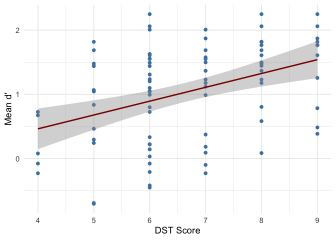
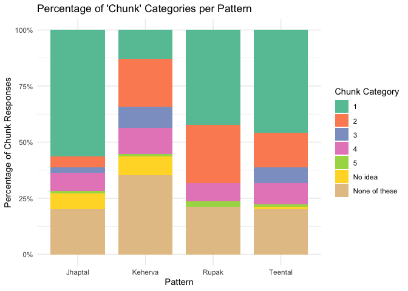
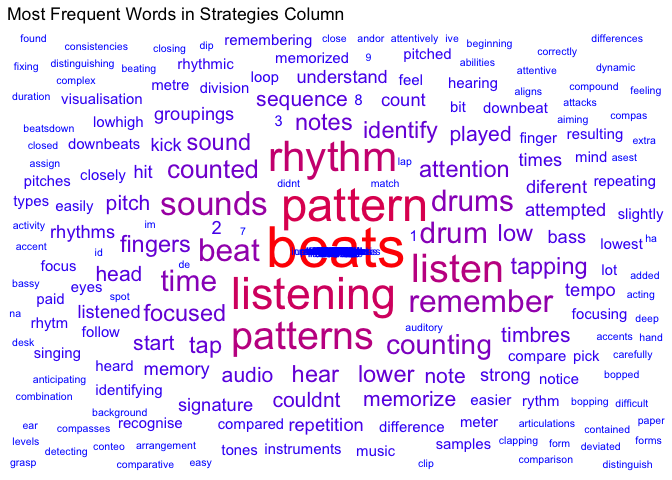
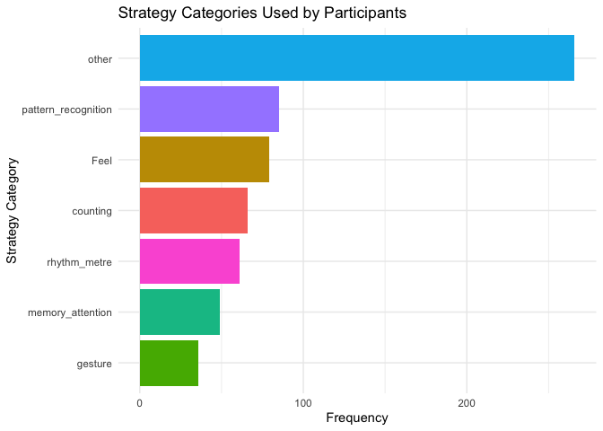
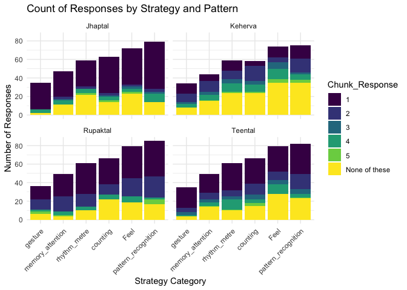
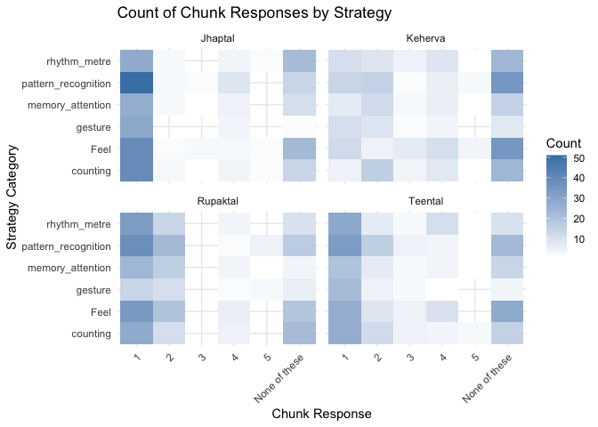
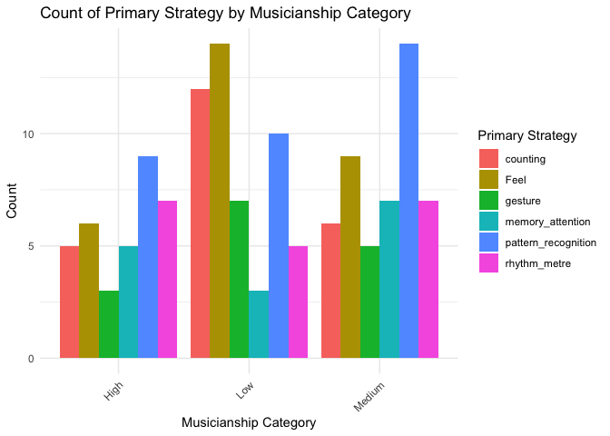

Analysis Script
================
Nashra Ahmad

## Set up libraries

``` r
library(tidyverse)
library(ggplot2)
library(stringr)
library(dplyr)
library(psycho)

library(ggsignif)

library(lme4)
library(emmeans)
library(lmerTest)
library(robust)

library(tidytext)
library(ggwordcloud)
```

## Read data

``` r
data1_long<-read.csv('IndianRhythmDiscrimination_DST_Data.csv',skip = 0,header = TRUE)
data1_long <- data1_long %>% filter(value != "" & !is.na(value)) #deleting empty responses
```

## Step 1: Dprime using the pakage

The dprime function (from the psycho() package) has been taken from:
Makowski, (2018). The psycho Package: an Efficient and
Publishing-Oriented Workflow for Psychological Science. Journal of Open
Source Software, 3(22), 470. <https://doi.org/10.21105/joss.00470>

``` r
# dprime_lab function
dprime_lab <- function(stim1, stim2, correct, data) {
  data$CorrectRej <- ifelse(data[[stim1]] != "Ntrl" & data[[stim2]] != "Ntrl" & data[[correct]] == TRUE, 1, NA)
  data$Miss <- ifelse(data[[stim1]] == "Ntrl" & data[[stim2]] == "Ntrl" & data[[correct]] == FALSE, 1, NA)
  data$FalseAlarm <- ifelse(data[[stim1]] != "Ntrl" & data[[stim2]] != "Ntrl" & data[[correct]] == FALSE, 1, NA)
  data$Hit <- ifelse(data[[stim1]] == "Ntrl" & data[[stim2]] == "Ntrl" & data[[correct]] == TRUE, 1, NA)
  return(data)
}

# dprime_cat function
dprime_cat <- function(data, id_col) {
  result <- data %>%
    group_by(across(all_of(id_col))) %>%
    summarize(
      Hits = sum(!is.na(Hit), na.rm = TRUE),
      Misses = sum(!is.na(Miss), na.rm = TRUE),
      FalseAlarms = sum(!is.na(FalseAlarm), na.rm = TRUE),
      CorrectRejs = sum(!is.na(CorrectRej), na.rm = TRUE),
      TotalTarg = Hits + Misses,
      TotalDis = FalseAlarms + CorrectRejs,
      NumRes = TotalTarg + TotalDis,
      .groups = "drop"
    )
  
  return(result)
}

# Adding columns for Stimulus and Response
data1_long <- data1_long %>%
  filter(!is.na(value)) %>% 
  mutate(correct = case_when(
    Stimuli2 == "Ntrl" & value == "Same" ~ TRUE,
    (Stimuli2 == "sdmi1" | Stimuli2 == "sdpl1") & value == "Different" ~ TRUE,
    TRUE ~ FALSE
  ))

#label each trial 
data1_long <- dprime_lab("Stimuli2", "Stimuli2", "correct", data = data1_long)

# Data for dprime
dprime_data <- data1_long %>%
  group_by(ResponseId, Pattern, Duration, Musicianship_Category, Musical_Training, DST_Score) %>%
  summarize(
    Hits = sum(!is.na(Hit), na.rm = TRUE),
    Misses = sum(!is.na(Miss), na.rm = TRUE),
    FalseAlarms = sum(!is.na(FalseAlarm), na.rm = TRUE),
    CorrectRejs = sum(!is.na(CorrectRej), na.rm = TRUE),
    TotalTarg = Hits + Misses,
    TotalDis = FalseAlarms + CorrectRejs,
    NumRes = TotalTarg + TotalDis,
    .groups = "drop"
  )

# Calculate d-prime
dprime_data <- dprime_data %>%
  rowwise() %>%
  mutate(
    dprime_result = list(psycho::dprime(
      n_hit = Hits,
      n_fa = FalseAlarms,
      n_miss = Misses,
      n_cr = CorrectRejs,
      adjusted = TRUE  # adjustments for extreme values Hautus (1995)
    )),
   
    dprime = dprime_result$dprime,
    beta = dprime_result$beta,
    criterion = dprime_result$c,
    aprime = dprime_result$aprime
    # Removed bppd which was added before as it was in the description but removed it as it caused an error.
  ) %>%
  ungroup() %>% 
  select(-dprime_result) 

# Join dprime values back to the original dataset data1_long for future use
data1_long <- data1_long %>%
  left_join(
    dprime_data %>% select(ResponseId, Pattern, Duration, dprime, beta, criterion, aprime),
    by = c("ResponseId", "Pattern", "Duration") 
  )


dprime_summary <- dprime_data %>%
  select(ResponseId, Pattern, Duration, Hits, Misses, FalseAlarms, CorrectRejs, 
         dprime, beta, criterion, aprime) %>%
  arrange(ResponseId, Pattern, Duration)

# Display dprime results
print(dprime_summary)
```

    ## # A tibble: 360 × 11
    ##    ResponseId Pattern Duration  Hits Misses FalseAlarms CorrectRejs dprime  beta
    ##    <chr>      <chr>      <dbl> <int>  <int>       <int>       <int>  <dbl> <dbl>
    ##  1 R_1a2kT4s… Jhaptal      5       2      0           0           4  2.25  1.42 
    ##  2 R_1a2kT4s… Keherva      4       2      0           0           4  2.25  1.42 
    ##  3 R_1a2kT4s… Rupak        3.5     1      1           2           2  0     1    
    ##  4 R_1a2kT4s… Teental      8       2      0           0           4  2.25  1.42 
    ##  5 R_1fAJ28Q… Jhaptal      4       1      1           2           2  0     1    
    ##  6 R_1fAJ28Q… Keherva      3.5     2      0           0           4  2.25  1.42 
    ##  7 R_1fAJ28Q… Rupak        8       2      0           3           1  0.443 0.719
    ##  8 R_1fAJ28Q… Teental      5       2      0           0           4  2.25  1.42 
    ##  9 R_1v5DHxR… Jhaptal      4       2      0           0           4  2.25  1.42 
    ## 10 R_1v5DHxR… Keherva      3.5     2      0           0           4  2.25  1.42 
    ## # ℹ 350 more rows
    ## # ℹ 2 more variables: criterion <dbl>, aprime <dbl>

``` r
data1_long %>%
 group_by(Pattern, Duration) %>%
 summarise(unique_participants = n_distinct(ResponseId)) %>%
 arrange(Pattern, Duration)
```

    ## `summarise()` has grouped output by 'Pattern'. You can override using the
    ## `.groups` argument.

    ## # A tibble: 16 × 3
    ## # Groups:   Pattern [4]
    ##    Pattern Duration unique_participants
    ##    <chr>      <dbl>               <int>
    ##  1 Jhaptal      3.5                  21
    ##  2 Jhaptal      4                    23
    ##  3 Jhaptal      5                    22
    ##  4 Jhaptal      8                    24
    ##  5 Keherva      3.5                  23
    ##  6 Keherva      4                    22
    ##  7 Keherva      5                    24
    ##  8 Keherva      8                    21
    ##  9 Rupak        3.5                  22
    ## 10 Rupak        4                    24
    ## 11 Rupak        5                    21
    ## 12 Rupak        8                    23
    ## 13 Teental      3.5                  24
    ## 14 Teental      4                    21
    ## 15 Teental      5                    23
    ## 16 Teental      8                    22

``` r
# Count total responses per participant
data1_long %>% 
  group_by(ResponseId) %>%
  summarise(total_responses = n()) %>%
  arrange(total_responses)
```

    ## # A tibble: 90 × 2
    ##    ResponseId        total_responses
    ##    <chr>                       <int>
    ##  1 R_1a2kT4sTZ1umjXH              24
    ##  2 R_1fAJ28QQRygC20l              24
    ##  3 R_1v5DHxRRtU5AbzO              24
    ##  4 R_21nqGlJXGY4v8Jb              24
    ##  5 R_22Q25krmP2LlT9U              24
    ##  6 R_25cSS3BRq8iLBKN              24
    ##  7 R_26ECudQ82Quje4p              24
    ##  8 R_27G0cnE8h7RcWGJ              24
    ##  9 R_29ORVsytj5uGQHD              24
    ## 10 R_2C8Nvjb39HY9yxP              24
    ## # ℹ 80 more rows

``` r
# Count responses per participant by pattern and duration
data1_long %>%
  group_by(ResponseId, Pattern, Duration) %>%
  summarise(responses = n(), .groups = "drop") %>%
  arrange(ResponseId, Pattern, Duration)
```

    ## # A tibble: 360 × 4
    ##    ResponseId        Pattern Duration responses
    ##    <chr>             <chr>      <dbl>     <int>
    ##  1 R_1a2kT4sTZ1umjXH Jhaptal      5           6
    ##  2 R_1a2kT4sTZ1umjXH Keherva      4           6
    ##  3 R_1a2kT4sTZ1umjXH Rupak        3.5         6
    ##  4 R_1a2kT4sTZ1umjXH Teental      8           6
    ##  5 R_1fAJ28QQRygC20l Jhaptal      4           6
    ##  6 R_1fAJ28QQRygC20l Keherva      3.5         6
    ##  7 R_1fAJ28QQRygC20l Rupak        8           6
    ##  8 R_1fAJ28QQRygC20l Teental      5           6
    ##  9 R_1v5DHxRRtU5AbzO Jhaptal      4           6
    ## 10 R_1v5DHxRRtU5AbzO Keherva      3.5         6
    ## # ℹ 350 more rows

``` r
duplicated_rows <- data1_long %>%
  group_by(ResponseId, Pattern, Duration, value) %>%
  filter(n() > 1) %>%
  arrange(ResponseId, Pattern, Duration)

#print(duplicated_rows)

participant_counts <- data1_long %>%
  group_by(ResponseId) %>%
  summarise(total_entries = n()) %>%
  arrange(desc(total_entries))

# View the results
print(participant_counts)
```

    ## # A tibble: 90 × 2
    ##    ResponseId        total_entries
    ##    <chr>                     <int>
    ##  1 R_1a2kT4sTZ1umjXH            24
    ##  2 R_1fAJ28QQRygC20l            24
    ##  3 R_1v5DHxRRtU5AbzO            24
    ##  4 R_21nqGlJXGY4v8Jb            24
    ##  5 R_22Q25krmP2LlT9U            24
    ##  6 R_25cSS3BRq8iLBKN            24
    ##  7 R_26ECudQ82Quje4p            24
    ##  8 R_27G0cnE8h7RcWGJ            24
    ##  9 R_29ORVsytj5uGQHD            24
    ## 10 R_2C8Nvjb39HY9yxP            24
    ## # ℹ 80 more rows

``` r
hist(data1_long$dprime)
```

<!-- -->

Adding heatmap plot to visualise

``` r
# Create a tile/heatmap style plot
sdt_counts <- dprime_data %>%
  group_by(Pattern, Duration) %>%
  summarise(
Hit = mean(Hits, na.rm = TRUE),
Miss = mean(Misses, na.rm = TRUE),
FA = mean(FalseAlarms, na.rm = TRUE),
CR = mean(CorrectRejs, na.rm = TRUE),
    .groups = "drop"
  ) %>%
  pivot_longer(
    cols = c(Hit, Miss, FA, CR),
    names_to = "Response_Type",
    values_to = "Count"
  ) %>%
  mutate(
    Response_Type = factor(Response_Type, 
                          levels = c("Hit", "Miss", "FA", "CR")),
    # Create position for 2x2 grid
    x_pos = case_when(
      Response_Type %in% c("Hit", "Miss") ~ 1,
      TRUE ~ 2
    ),
    y_pos = case_when(
      Response_Type %in% c("Hit", "FA") ~ 2,
      TRUE ~ 1
    )
  )

# Create the plot with rectangular tiles
ggplot(sdt_counts, aes(x = x_pos, y = y_pos, fill = Count)) +
  geom_tile(color = "white", size = 1) +
  geom_text(aes(label = paste0(Response_Type, "\n", round(Count, 1))), 
            color = "white", size = 3, fontface = "bold") +
  facet_grid(Pattern ~ Duration, labeller = label_both) +
  scale_fill_gradient(low = "lightblue", high = "darkblue") +
  scale_x_continuous(breaks = NULL) +
  scale_y_continuous(breaks = NULL) +
  labs(
    title = "Signal Detection Results",
    #subtitle = "Four response types for each Pattern-Duration combination",
    fill = "Count"
  ) +
  theme_minimal() +
  theme(
    plot.title = element_text(hjust = 0.5, face = "bold"),
    plot.subtitle = element_text(hjust = 0.5),
    axis.title = element_blank(),
    axis.text = element_blank(),
    panel.grid = element_blank()
  ) +
  coord_fixed()
```

    ## Warning: Using `size` aesthetic for lines was deprecated in ggplot2 3.4.0.
    ## ℹ Please use `linewidth` instead.
    ## This warning is displayed once every 8 hours.
    ## Call `lifecycle::last_lifecycle_warnings()` to see where this warning was
    ## generated.

<!-- -->

Small step to do the power test to test number of participants with
actual data

``` r
data1_long$Duration <- factor(data1_long$Duration)
dprime_table <- data1_long %>%
  group_by(Pattern, Duration) %>%
   summarise(mean_dprime = round(mean(dprime, na.rm = TRUE), 2), .groups = "drop") %>%
  pivot_wider(names_from = Duration, values_from = mean_dprime)

print(dprime_table)
```

    ## # A tibble: 4 × 5
    ##   Pattern `3.5`   `4`   `5`   `8`
    ##   <chr>   <dbl> <dbl> <dbl> <dbl>
    ## 1 Jhaptal  0.84  1.27  1.12  0.34
    ## 2 Keherva  1.6   0.79  1.17  0.98
    ## 3 Rupak    1.09  0.96  0.64  0.5 
    ## 4 Teental  1.45  1.46  1.48  0.72

``` r
#power analysis: hidden as not required at analysis stage

library(Superpower)
#design_result <- ANOVA_design(design = "4b*4w",
  #                            n = 15, 
  #                            mu = #c(1.50,0.68,0.97,0.78,0.69,1.11,0.73,0.47,0.89,0.90,0.52,0.64,1.45,0.91,1.51,0.47), 
 #                             sd = 0.57, #as above
 #                             r = 0.75, 
 #                             label_list = list("rhythm"  = c("8", "10","7","16"),
 #                             "Duration" = c( "3.5", "4", "5","8")),
 #                             plot = TRUE)
#power_result_vig_1 <- ANOVA_power(design_result, 
#                                  alpha = 0.05, 
#                                  nsims = 1000, 
#                                  seed = 12345,
#                                  verbose = FALSE)
#print(knitr::kable(confint(power_result_vig_1, level = .95)))
```

## Step 2: Analysing Discrimination, through dprime

``` r
dprime_data$Duration <- factor(dprime_data$Duration)


dprime_data$Pattern <- case_when(
  dprime_data$Pattern == "Rupak" ~ "7-Rupaktal",
  dprime_data$Pattern == "Keherva" ~ "8-Keherva", 
  dprime_data$Pattern == "Jhaptal" ~ "10-Jhaptal",
  dprime_data$Pattern == "Teental" ~ "16-Teental",
  TRUE ~ as.character(dprime_data$Pattern)
)

dprime_data$Pattern <- factor(dprime_data$Pattern, 
                             levels = c("7-Rupaktal", "8-Keherva", "10-Jhaptal", "16-Teental"))

dprime_data$ResponseId <- factor(dprime_data$ResponseId)

# Basic descriptive statistics
# Mean dprime scores by Pattern
pattern_means <- aggregate(dprime ~ Pattern, data = dprime_data, FUN = mean)
print("Mean d-prime scores by Pattern:")
```

    ## [1] "Mean d-prime scores by Pattern:"

``` r
print(pattern_means)
```

    ##      Pattern    dprime
    ## 1 7-Rupaktal 0.8001780
    ## 2  8-Keherva 1.1408693
    ## 3 10-Jhaptal 0.8865605
    ## 4 16-Teental 1.2836936

``` r
# Mean dprime scores by Duration
duration_means <- aggregate(dprime ~ Duration, data = dprime_data, FUN = mean)
print("Mean d-prime scores by Duration:")
```

    ## [1] "Mean d-prime scores by Duration:"

``` r
print(duration_means)
```

    ##   Duration    dprime
    ## 1      3.5 1.2571213
    ## 2        4 1.1134462
    ## 3        5 1.1161588
    ## 4        8 0.6245751

``` r
dprime_model <- lmer(dprime ~ Pattern * Duration + DST_Score + (1|ResponseId), data = dprime_data)
# Check model summary
summary(dprime_model)
```

    ## Linear mixed model fit by REML. t-tests use Satterthwaite's method [
    ## lmerModLmerTest]
    ## Formula: dprime ~ Pattern * Duration + DST_Score + (1 | ResponseId)
    ##    Data: dprime_data
    ## 
    ## REML criterion at convergence: 952.5
    ## 
    ## Scaled residuals: 
    ##     Min      1Q  Median      3Q     Max 
    ## -2.6487 -0.5688  0.1158  0.6286  2.3515 
    ## 
    ## Random effects:
    ##  Groups     Name        Variance Std.Dev.
    ##  ResponseId (Intercept) 0.3189   0.5648  
    ##  Residual               0.6021   0.7760  
    ## Number of obs: 360, groups:  ResponseId, 90
    ## 
    ## Fixed effects:
    ##                              Estimate Std. Error        df t value Pr(>|t|)    
    ## (Intercept)                  -0.34361    0.38028 114.41653  -0.904   0.3681    
    ## Pattern8-Keherva              0.56255    0.28644 250.30890   1.964   0.0506 .  
    ## Pattern10-Jhaptal            -0.41777    0.29539 246.32138  -1.414   0.1585    
    ## Pattern16-Teental             0.32954    0.28341 250.49588   1.163   0.2460    
    ## Duration4                    -0.16413    0.28341 250.49588  -0.579   0.5630    
    ## Duration5                    -0.61462    0.29539 246.32138  -2.081   0.0385 *  
    ## Duration8                    -0.53062    0.28644 250.30890  -1.852   0.0651 .  
    ## DST_Score                     0.22296    0.05001  85.00000   4.458 2.51e-05 ***
    ## Pattern8-Keherva:Duration4   -0.69452    0.43722 181.24172  -1.589   0.1139    
    ## Pattern10-Jhaptal:Duration4   0.81563    0.40951 245.40369   1.992   0.0475 *  
    ## Pattern16-Teental:Duration4   0.03559    0.43535 185.40205   0.082   0.9349    
    ## Pattern8-Keherva:Duration5    0.10049    0.40558 250.20343   0.248   0.8045    
    ## Pattern10-Jhaptal:Duration5   1.07051    0.48676 141.35429   2.199   0.0295 *  
    ## Pattern16-Teental:Duration5   0.73265    0.40951 245.40369   1.789   0.0748 .  
    ## Pattern8-Keherva:Duration8   -0.31645    0.44438 181.70372  -0.712   0.4773    
    ## Pattern10-Jhaptal:Duration8   0.16852    0.40558 250.20343   0.416   0.6781    
    ## Pattern16-Teental:Duration8  -0.16067    0.43722 181.24172  -0.367   0.7137    
    ## ---
    ## Signif. codes:  0 '***' 0.001 '**' 0.01 '*' 0.05 '.' 0.1 ' ' 1

    ## 
    ## Correlation matrix not shown by default, as p = 17 > 12.
    ## Use print(x, correlation=TRUE)  or
    ##     vcov(x)        if you need it

``` r
# ANOVA table for fixed effects
print("ANOVA table for fixed effects:")
```

    ## [1] "ANOVA table for fixed effects:"

``` r
anova_results <- anova(dprime_model)
print(anova_results)
```

    ## Type III Analysis of Variance Table with Satterthwaite's method
    ##                  Sum Sq Mean Sq NumDF DenDF F value    Pr(>F)    
    ## Pattern          13.027  4.3423     3 258.0  7.2118  0.000115 ***
    ## Duration         19.247  6.4158     3 258.0 10.6556 1.256e-06 ***
    ## DST_Score        11.966 11.9663     1  85.0 19.8740 2.511e-05 ***
    ## Pattern:Duration 12.714  1.4127     9 193.1  2.3462  0.015612 *  
    ## ---
    ## Signif. codes:  0 '***' 0.001 '**' 0.01 '*' 0.05 '.' 0.1 ' ' 1

``` r
# Check if Pattern effect is significant
if(anova_results["Pattern", "Pr(>F)"] < 0.05) {
  print("Pattern effect is significant. Post-hoc comparisons:")
  pattern_emm <- emmeans(dprime_model, ~ Pattern)
  pattern_pairs <- pairs(pattern_emm, adjust = "tukey")
  print(pattern_pairs)
}
```

    ## [1] "Pattern effect is significant. Post-hoc comparisons:"

    ## NOTE: Results may be misleading due to involvement in interactions

    ##  contrast                    estimate    SE  df t.ratio p.value
    ##  (7-Rupaktal) - (8-Keherva)   -0.3349 0.116 258  -2.892  0.0215
    ##  (7-Rupaktal) - (10-Jhaptal)  -0.0959 0.116 258  -0.828  0.8412
    ##  (7-Rupaktal) - (16-Teental)  -0.4814 0.116 258  -4.157  0.0003
    ##  (8-Keherva) - (10-Jhaptal)    0.2390 0.116 258   2.064  0.1678
    ##  (8-Keherva) - (16-Teental)   -0.1465 0.116 258  -1.265  0.5861
    ##  (10-Jhaptal) - (16-Teental)  -0.3855 0.116 258  -3.329  0.0055
    ## 
    ## Results are averaged over the levels of: Duration 
    ## Degrees-of-freedom method: kenward-roger 
    ## P value adjustment: tukey method for comparing a family of 4 estimates

``` r
# Check if Duration effect is significant
if(anova_results["Duration", "Pr(>F)"] < 0.05) {
  print("Duration effect is significant. Post-hoc comparisons:")
  duration_emm <- emmeans(dprime_model, ~ Duration)
  duration_pairs <- pairs(duration_emm, adjust = "tukey")
  print(duration_pairs)
}
```

    ## [1] "Duration effect is significant. Post-hoc comparisons:"

    ## NOTE: Results may be misleading due to involvement in interactions

    ##  contrast                estimate    SE  df t.ratio p.value
    ##  Duration3.5 - Duration4   0.1250 0.116 258   1.079  0.7027
    ##  Duration3.5 - Duration5   0.1387 0.116 258   1.198  0.6289
    ##  Duration3.5 - Duration8   0.6078 0.116 258   5.248  <.0001
    ##  Duration4 - Duration5     0.0138 0.116 258   0.119  0.9994
    ##  Duration4 - Duration8     0.4828 0.116 258   4.169  0.0002
    ##  Duration5 - Duration8     0.4691 0.116 258   4.050  0.0004
    ## 
    ## Results are averaged over the levels of: Pattern 
    ## Degrees-of-freedom method: kenward-roger 
    ## P value adjustment: tukey method for comparing a family of 4 estimates

``` r
# Check if interaction effect is significant
if(anova_results["Pattern:Duration", "Pr(>F)"] < 0.09) {
  print("Interaction effect is ....")
  print("Examining Duration effects within each Pattern level:")
  interaction_emm <- emmeans(dprime_model, ~ Duration | Pattern)
  interaction_pairs <- pairs(interaction_emm, adjust = "tukey")
  print(interaction_pairs)
}
```

    ## [1] "Interaction effect is ...."
    ## [1] "Examining Duration effects within each Pattern level:"
    ## Pattern = 7-Rupaktal:
    ##  contrast                estimate    SE  df t.ratio p.value
    ##  Duration3.5 - Duration4   0.1641 0.283 250   0.579  0.9383
    ##  Duration3.5 - Duration5   0.6146 0.295 246   2.081  0.1623
    ##  Duration3.5 - Duration8   0.5306 0.286 250   1.852  0.2515
    ##  Duration4 - Duration5     0.4505 0.288 248   1.562  0.4022
    ##  Duration4 - Duration8     0.3665 0.281 249   1.305  0.5605
    ##  Duration5 - Duration8    -0.0840 0.294 243  -0.286  0.9919
    ## 
    ## Pattern = 8-Keherva:
    ##  contrast                estimate    SE  df t.ratio p.value
    ##  Duration3.5 - Duration4   0.8587 0.286 250   2.998  0.0158
    ##  Duration3.5 - Duration5   0.5141 0.281 249   1.831  0.2612
    ##  Duration3.5 - Duration8   0.8471 0.294 243   2.880  0.0223
    ##  Duration4 - Duration5    -0.3445 0.283 250  -1.216  0.6175
    ##  Duration4 - Duration8    -0.0116 0.295 246  -0.039  1.0000
    ##  Duration5 - Duration8     0.3329 0.288 248   1.155  0.6561
    ## 
    ## Pattern = 10-Jhaptal:
    ##  contrast                estimate    SE  df t.ratio p.value
    ##  Duration3.5 - Duration4  -0.6515 0.294 243  -2.215  0.1220
    ##  Duration3.5 - Duration5  -0.4559 0.295 246  -1.543  0.4132
    ##  Duration3.5 - Duration8   0.3621 0.288 248   1.256  0.5920
    ##  Duration4 - Duration5     0.1956 0.286 250   0.683  0.9035
    ##  Duration4 - Duration8     1.0136 0.281 249   3.610  0.0021
    ##  Duration5 - Duration8     0.8180 0.283 250   2.886  0.0219
    ## 
    ## Pattern = 16-Teental:
    ##  contrast                estimate    SE  df t.ratio p.value
    ##  Duration3.5 - Duration4   0.1285 0.288 248   0.446  0.9704
    ##  Duration3.5 - Duration5  -0.1180 0.281 249  -0.420  0.9750
    ##  Duration3.5 - Duration8   0.6913 0.283 250   2.439  0.0725
    ##  Duration4 - Duration5    -0.2466 0.294 243  -0.838  0.8361
    ##  Duration4 - Duration8     0.5628 0.295 246   1.905  0.2285
    ##  Duration5 - Duration8     0.8093 0.286 250   2.825  0.0261
    ## 
    ## Degrees-of-freedom method: kenward-roger 
    ## P value adjustment: tukey method for comparing a family of 4 estimates

``` r
# Check if interaction effect is significant
if(anova_results["Pattern:Duration", "Pr(>F)"] < 0.09) {
  print("Interaction effect is ...")
  print("Examining Pattern effects within each Duration level:")
  interaction_emm <- emmeans(dprime_model, ~ Pattern | Duration)
  interaction_pairs <- pairs(interaction_emm, adjust = "tukey")
  print(interaction_pairs)
}
```

    ## [1] "Interaction effect is ..."
    ## [1] "Examining Pattern effects within each Duration level:"
    ## Duration = 3.5:
    ##  contrast                    estimate    SE  df t.ratio p.value
    ##  (7-Rupaktal) - (8-Keherva)   -0.5626 0.286 250  -1.964  0.2045
    ##  (7-Rupaktal) - (10-Jhaptal)   0.4178 0.295 246   1.414  0.4916
    ##  (7-Rupaktal) - (16-Teental)  -0.3295 0.283 250  -1.163  0.6509
    ##  (8-Keherva) - (10-Jhaptal)    0.9803 0.294 243   3.333  0.0054
    ##  (8-Keherva) - (16-Teental)    0.2330 0.281 249   0.830  0.8403
    ##  (10-Jhaptal) - (16-Teental)  -0.7473 0.288 248  -2.591  0.0494
    ## 
    ## Duration = 4:
    ##  contrast                    estimate    SE  df t.ratio p.value
    ##  (7-Rupaktal) - (8-Keherva)    0.1320 0.283 250   0.466  0.9665
    ##  (7-Rupaktal) - (10-Jhaptal)  -0.3979 0.281 249  -1.417  0.4900
    ##  (7-Rupaktal) - (16-Teental)  -0.3651 0.288 248  -1.266  0.5853
    ##  (8-Keherva) - (10-Jhaptal)   -0.5298 0.286 250  -1.850  0.2527
    ##  (8-Keherva) - (16-Teental)   -0.4971 0.295 246  -1.683  0.3349
    ##  (10-Jhaptal) - (16-Teental)   0.0327 0.294 243   0.111  0.9995
    ## 
    ## Duration = 5:
    ##  contrast                    estimate    SE  df t.ratio p.value
    ##  (7-Rupaktal) - (8-Keherva)   -0.6630 0.288 248  -2.299  0.1010
    ##  (7-Rupaktal) - (10-Jhaptal)  -0.6527 0.295 246  -2.210  0.1234
    ##  (7-Rupaktal) - (16-Teental)  -1.0622 0.294 243  -3.612  0.0021
    ##  (8-Keherva) - (10-Jhaptal)    0.0103 0.283 250   0.036  1.0000
    ##  (8-Keherva) - (16-Teental)   -0.3992 0.281 249  -1.422  0.4871
    ##  (10-Jhaptal) - (16-Teental)  -0.4095 0.286 250  -1.429  0.4822
    ## 
    ## Duration = 8:
    ##  contrast                    estimate    SE  df t.ratio p.value
    ##  (7-Rupaktal) - (8-Keherva)   -0.2461 0.294 243  -0.837  0.8369
    ##  (7-Rupaktal) - (10-Jhaptal)   0.2493 0.281 249   0.888  0.8113
    ##  (7-Rupaktal) - (16-Teental)  -0.1689 0.286 250  -0.590  0.9352
    ##  (8-Keherva) - (10-Jhaptal)    0.4954 0.288 248   1.718  0.3166
    ##  (8-Keherva) - (16-Teental)    0.0772 0.295 246   0.261  0.9937
    ##  (10-Jhaptal) - (16-Teental)  -0.4181 0.283 250  -1.475  0.4539
    ## 
    ## Degrees-of-freedom method: kenward-roger 
    ## P value adjustment: tukey method for comparing a family of 4 estimates

# Visualise dprime scores

These figures are just to visualise the results without added
significant indicators.

``` r
# Calculate statistics for different groupings in one go
dprime_stats_full <- dprime_data %>%
  group_by(Pattern, Duration) %>%
  summarize(
    mean_dprime = mean(dprime, na.rm = TRUE),
    se_dprime = sd(dprime, na.rm = TRUE) / sqrt(n()),
    .groups = "drop"
  )

dprime_stats_pattern <- dprime_data %>%
  group_by(Pattern) %>%
  summarize(
    mean_dprime = mean(dprime, na.rm = TRUE),
    se_dprime = sd(dprime, na.rm = TRUE) / sqrt(n()),
    .groups = "drop"
  )

dprime_stats_duration <- dprime_data %>%
  group_by(Duration) %>%
  summarize(
    mean_dprime = mean(dprime, na.rm = TRUE),
    se_dprime = sd(dprime, na.rm = TRUE) / sqrt(n()),
    .groups = "drop"
  )

# Create a color-blind friendly palette
my_colors <- c("#E69F00", "#56B4E9", "#009E73", "#F0E442")
my_colors2 <- c("#D55E00", "#0072B2", "#CC79A7", "#999999")

# Set common theme elements
my_theme <- theme_minimal() +
  theme(
    text = element_text(size = 12),
    axis.title = element_text(face = "bold"),
    legend.position = "top",
    plot.title = element_text(hjust = 0.5, face = "bold", size = 14),
    panel.grid.minor = element_blank()
  )


# Pattern plot
p_pattern <- ggplot(dprime_stats_pattern, aes(x = Pattern, y = mean_dprime)) +
  geom_bar(stat = "identity", width = 0.6, fill = "#3182bd") +
  geom_errorbar(aes(ymin = mean_dprime - se_dprime, ymax = mean_dprime + se_dprime),
                width = 0.2, color = "black") +
  labs(
    title = "D-prime Scores by Pattern",
    x = "Pattern",
    y = "D-prime Score (Mean ± SE)"
  ) +
  my_theme +
  theme(axis.text.x = element_text(angle = 45, hjust = 1)) # Angled labels for better fit

# Duration plot
p_duration <- ggplot(dprime_stats_duration, aes(x = Duration, y = mean_dprime)) +
  geom_bar(stat = "identity", width = 0.6, fill = "#31a354") +
  geom_errorbar(aes(ymin = mean_dprime - se_dprime, ymax = mean_dprime + se_dprime),
                width = 0.2, color = "black") +
  labs(
    title = "D-prime Scores by Duration",
    x = "Duration (seconds)",
    y = "D-prime Score (Mean ± SE)"
  ) +
  my_theme


# Interaction plot (Pattern × Duration)
p_interaction1 <- ggplot(dprime_stats_full, aes(x = Pattern, y = mean_dprime, fill = Duration)) +
  geom_bar(stat = "identity", position = position_dodge(width = 0.8), width = 0.7) +
  geom_errorbar(aes(ymin = mean_dprime - se_dprime, ymax = mean_dprime + se_dprime),
                position = position_dodge(width = 0.8), width = 0.2, color = "black") +
  scale_fill_manual(values = my_colors2) +
  labs(
    title = "D-prime Scores by Pattern by each Duration",
    x = "Pattern",
    y = "D-prime Score (Mean ± SE)",
    fill = "Duration"
  ) +
  my_theme +
  theme(axis.text.x = element_text(angle = 45, hjust = 1))

p_interaction2 <- ggplot(dprime_stats_full, aes(x = Duration, y = mean_dprime, color = Pattern, group = Pattern)) +
  geom_line(size = 1) +
  geom_point(size = 3) +
  #geom_errorbar(aes(ymin = mean_dprime - se_dprime, ymax = mean_dprime + se_dprime),
  #              width = 0.2) +
  scale_color_manual(values = my_colors2) +
  labs(
    #title = "D-prime Scores by Duration for Each Pattern",
    x = "Duration",
    y = "D-prime Score (Mean ± SE)",
    color = "Pattern"
  ) +
  my_theme +
  theme(axis.text.x = element_text(angle = 45, hjust = 1))

# Display plots

#p_pattern
#p_duration
#p_interaction1
#p_interaction2
```

Making final figures by manually adding significant indicators

``` r
# PATTERN PLOT WITH SIGNIFICANCE
p_pattern <- ggplot(dprime_stats_pattern, aes(x = Pattern, y = mean_dprime)) +
  geom_bar(stat = "identity", width = 0.6, fill = "#3182bd") +
  geom_errorbar(aes(ymin = mean_dprime - se_dprime, ymax = mean_dprime + se_dprime),
                width = 0.2, color = "black") +
  # 7-Rupaktal vs 8-Keherva (p = 0.0215)
  annotate("segment", x = 1, xend = 2, y = 1.4, yend = 1.4, color = "black") +
  annotate("text", x = 1.5, y = 1.45, label = "*", size = 5) +
  # 7-Rupaktal vs 16-Teental (p = 0.0003)
  annotate("segment", x = 1, xend = 4, y = 1.6, yend = 1.6, color = "black") +
  annotate("text", x = 2.5, y = 1.65, label = "***", size = 5) +
  # 10-Jhaptal vs 16-Teental (p = 0.0055)
  annotate("segment", x = 3, xend = 4, y = 1.5, yend = 1.5, color = "black") +
  annotate("text", x = 3.5, y = 1.54, label = "**", size = 5) +
  labs(
   # title = "D-prime Scores by Pattern",
    x = "Pattern",
    y = "D-prime Score (Mean ± SE)"
  ) +
  my_theme +
   theme(axis.line = element_line(color = "black", size = 0.5)) +
  theme(axis.text.x = element_text(angle = 45, hjust = 1))
```

    ## Warning: The `size` argument of `element_line()` is deprecated as of ggplot2 3.4.0.
    ## ℹ Please use the `linewidth` argument instead.
    ## This warning is displayed once every 8 hours.
    ## Call `lifecycle::last_lifecycle_warnings()` to see where this warning was
    ## generated.

``` r
# DURATION PLOT WITH SIGNIFICANCE
p_duration <- ggplot(dprime_stats_duration, aes(x = Duration, y = mean_dprime)) +
  geom_bar(stat = "identity", width = 0.6, fill = "#31a354") +
  geom_errorbar(aes(ymin = mean_dprime - se_dprime, ymax = mean_dprime + se_dprime),
                width = 0.2, color = "black") +
  # Duration3.5 vs Duration8 (positions 1 to 4)
  annotate("segment", x = 1, xend = 4, y = 1.5, yend = 1.5, color = "black") +
  annotate("text", x = 2.5, y = 1.53, label = "***", size = 5) +
  # Duration4 vs Duration8 (positions 2 to 4)
  annotate("segment", x = 2, xend = 4, y = 1.4, yend = 1.4, color = "black") +
  annotate("text", x = 3.0, y = 1.43, label = "***", size = 5) +
  # Duration5 vs Duration8 (positions 3 to 4)
  annotate("segment", x = 3, xend = 4, y = 1.3, yend = 1.3, color = "black") +
  annotate("text", x = 3.5, y = 1.33, label = "***", size = 5) +
  labs(
   # title = "D-prime Scores by Duration",
    x = "Duration (seconds)",
    y = "D-prime Score (Mean ± SE)"
  ) +
  my_theme+
   theme(axis.line = element_line(color = "black", size = 0.5))

# INTERACTION PLOT WITH SIGNIFICANCE
p_interaction <- ggplot(dprime_stats_full, aes(x = Pattern, y = mean_dprime, fill = Duration)) +
  geom_bar(stat = "identity", position = position_dodge(width = 0.8), width = 0.7) +
  geom_errorbar(aes(ymin = mean_dprime - se_dprime, ymax = mean_dprime + se_dprime),
                position = position_dodge(width = 0.8), width = 0.2, color = "black") +
  scale_fill_manual(values = my_colors2) +
  labs(
    #title = "D-prime Scores by Pattern × Duration Interaction",
    x = "Pattern",
    y = "D-prime Score (Mean ± SE)",
    fill = "Duration"
  ) +
  my_theme +
   theme(axis.line = element_line(color = "black", size = 0.5)) +
  theme(axis.text.x = element_text(angle = 45, hjust = 1)) +
  
  # Within-pattern duration comparisons (black) - with brackets
  # 8-Keherva: Duration3.5 vs Duration4
  annotate("segment", x = 1.7, xend = 1.7, y = 1.75, yend = 1.85, color = "black") +
  annotate("segment", x = 1.7, xend = 1.9, y = 1.85, yend = 1.85, color = "black") +
  annotate("segment", x = 1.9, xend = 1.9, y = 1.75, yend = 1.85, color = "black") +
  annotate("text", x = 1.82, y = 1.86, label = "*", size = 5) +
  
  # 8-Keherva: Duration3.5 vs Duration8
  annotate("segment", x = 1.7, xend = 1.7, y = 1.88, yend = 2, color = "black") +
  annotate("segment", x = 1.7, xend = 2.3, y = 2, yend = 2, color = "black") +
  annotate("segment", x = 2.3, xend = 2.3, y = 1.88, yend = 2, color = "black") +
  annotate("text", x = 2.0, y = 2.01, label = "*", size = 5) +
  
  # 10-Jhaptal: Duration4 vs Duration8
  annotate("segment", x = 2.9, xend = 2.9, y = 1.75, yend = 1.85, color = "black") +
  annotate("segment", x = 2.9, xend = 3.3, y = 1.85, yend = 1.85, color = "black") +
  annotate("segment", x = 3.3, xend = 3.3, y = 1.75, yend = 1.85, color = "black") +
  annotate("text", x = 3.1, y = 1.86, label = "**", size = 5) +
  
  # 10-Jhaptal: Duration5 vs Duration8
  annotate("segment", x = 3.1, xend = 3.1, y = 1.54, yend = 1.65, color = "black") +
  annotate("segment", x = 3.1, xend = 3.3, y = 1.65, yend = 1.65, color = "black") +
  annotate("segment", x = 3.3, xend = 3.3, y = 1.54, yend = 1.65, color = "black") +
  annotate("text", x = 3.2, y = 1.67, label = "*", size = 5) +
  
  # 16-Teental: Duration5 vs Duration8
  annotate("segment", x = 4.1, xend = 4.1, y = 1.62, yend = 1.75, color = "black") +
  annotate("segment", x = 4.1, xend = 4.3, y = 1.75, yend = 1.75, color = "black") +
  annotate("segment", x = 4.3, xend = 4.3, y = 1.62, yend = 1.75, color = "black") +
  annotate("text", x = 4.2, y = 1.77, label = "*", size = 5) +
  
  # Within-duration pattern comparisons (red) - with brackets
  # Duration3.5: 8-Keherva vs 10-Jhaptal
  annotate("segment", x = 1.7, xend = 1.7, y = 2.1, yend = 2.2, color = "red") +
  annotate("segment", x = 1.7, xend = 2.7, y = 2.2, yend = 2.2, color = "red") +
  annotate("segment", x = 2.7, xend = 2.7, y = 2.1, yend = 2.2, color = "red") +
  annotate("text", x = 2.2, y = 2.2, label = "**", size = 5, color = "red") +
  
  # Duration3.5: 10-Jhaptal vs 16-Teental
  annotate("segment", x = 2.7, xend = 2.7, y = 2.1, yend = 2.2, color = "red") +
  annotate("segment", x = 2.7, xend = 3.7, y = 2.2, yend = 2.2, color = "red") +
  annotate("segment", x = 3.7, xend = 3.7, y = 2.1, yend = 2.2, color = "red") +
  annotate("text", x = 3.2, y = 2.2, label = "*", size = 5, color = "red") +
  
  # Duration5: 7-Rupaktal vs 16-Teental
  annotate("segment", x = 1.1, xend = 1.1, y = 2.3, yend = 2.4, color = "red") +
  annotate("segment", x = 1.1, xend = 4.1, y = 2.4, yend = 2.4, color = "red") +
  annotate("segment", x = 4.1, xend = 4.1, y = 2.3, yend = 2.4, color = "red") +
  annotate("text", x = 2.6, y = 2.4, label = "**", size = 5, color = "red")

# Print plots
print(p_pattern)
```

<!-- -->

``` r
print(p_duration)
```

<!-- -->

``` r
print(p_interaction)
```

<!-- -->

``` r
# Save plots in good quality for viewing
#ggsave("p_pattern.jpg", plot = p_pattern, dpi = 300, width = 8, height = 6, units = "in")
#ggsave("p_duration.jpg", plot = p_duration, dpi = 300, width = 8, height = 6, units = "in")
#ggsave("p_interaction.jpg", plot = p_interaction, dpi = 300, width = 8, height = 6, units = "in")
```

Now, I want to see what happens in 3.5 and 8 seconds only, being the
shortest and longest. We can also take the average of 3.5 and 4 and call
it fast and 5 and 8 and call it slow.

Note that this part of the analysis is not added in the paper and is
exploratory in nature. The below image shows the effect of duration
again.

``` r
plot_data <- dprime_data %>%
  filter(Duration %in% c(3.5, 8))

plot_data$Duration <- factor(plot_data$Duration)
plot_data$Pattern <- factor(plot_data$Pattern)

summary_data <- plot_data %>%
  group_by(Pattern, Duration) %>%
  summarize(
    mean_dprime = mean(dprime, na.rm = TRUE),
    se = sd(dprime, na.rm = TRUE) / sqrt(n()),
    .groups = "drop"
  )

ggplot(summary_data, aes(x = Duration, y = mean_dprime, group = Pattern, color = Pattern, shape = Pattern)) +
  geom_point(size = 3) +
  geom_line(linewidth = 1) +
 # geom_errorbar(aes(ymin = mean_dprime - se, ymax = mean_dprime + se), width = 0.1) +
  labs(
    title = "D-prime by Duration across Different Patterns",
    x = "Duration (seconds)",
    y = "D-prime"
  ) +
  theme_minimal() +
  theme(
    legend.position = "top",
    panel.grid.minor = element_blank(),
    axis.text = element_text(size = 11),
    axis.title = element_text(size = 12, face = "bold")
  ) +
  scale_y_continuous() +
  coord_cartesian(ylim = c(min(summary_data$mean_dprime - summary_data$se) * 0.9, 
                           max(summary_data$mean_dprime + summary_data$se) * 1.1))
```

<!-- -->

``` r
lmer_model2 <- lmer(dprime ~ Pattern * Duration + (1|ResponseId), data = plot_data)
lmer_summary2 <- summary(lmer_model2)
print("Linear Mixed Model Results:")
```

    ## [1] "Linear Mixed Model Results:"

``` r
print(lmer_summary2)
```

    ## Linear mixed model fit by REML. t-tests use Satterthwaite's method [
    ## lmerModLmerTest]
    ## Formula: dprime ~ Pattern * Duration + (1 | ResponseId)
    ##    Data: plot_data
    ## 
    ## REML criterion at convergence: 497
    ## 
    ## Scaled residuals: 
    ##      Min       1Q   Median       3Q      Max 
    ## -2.24561 -0.60474  0.07888  0.68640  2.03293 
    ## 
    ## Random effects:
    ##  Groups     Name        Variance Std.Dev.
    ##  ResponseId (Intercept) 0.3243   0.5695  
    ##  Residual               0.6427   0.8017  
    ## Number of obs: 180, groups:  ResponseId, 90
    ## 
    ## Fixed effects:
    ##                              Estimate Std. Error        df t value Pr(>|t|)    
    ## (Intercept)                   1.08535    0.20966 154.61154   5.177 6.93e-07 ***
    ## Pattern8-Keherva              0.51012    0.29326 154.61154   1.739   0.0839 .  
    ## Pattern10-Jhaptal            -0.24356    0.30001 154.61154  -0.812   0.4181    
    ## Pattern16-Teental             0.36839    0.29026 154.61154   1.269   0.2063    
    ## Duration8                    -0.58306    0.29326 154.61154  -1.988   0.0486 *  
    ## Pattern8-Keherva:Duration8   -0.03736    0.44977 114.97162  -0.083   0.9339    
    ## Pattern10-Jhaptal:Duration8   0.08559    0.41514 154.61154   0.206   0.8369    
    ## Pattern16-Teental:Duration8  -0.14708    0.44692 112.63280  -0.329   0.7427    
    ## ---
    ## Signif. codes:  0 '***' 0.001 '**' 0.01 '*' 0.05 '.' 0.1 ' ' 1
    ## 
    ## Correlation of Fixed Effects:
    ##             (Intr) Ptt8-K Pt10-J Pt16-T Durtn8 P8-K:D P10-J:
    ## Pttrn8-Khrv -0.715                                          
    ## Pttrn10-Jhp -0.699  0.500                                   
    ## Pttrn16-Tnt -0.722  0.516  0.505                            
    ## Duration8   -0.715  0.675  0.500  0.516                     
    ## Pttrn8-K:D8  0.466 -0.759 -0.211 -0.337 -0.759              
    ## Pttr10-J:D8  0.505 -0.477 -0.723 -0.253 -0.706  0.453       
    ## Pttr16-T:D8  0.626 -0.555 -0.438 -0.763 -0.769  0.571  0.470

``` r
anova_lmer2 <- anova(lmer_model2)
print("ANOVA Table for Linear Mixed Model:")
```

    ## [1] "ANOVA Table for Linear Mixed Model:"

``` r
print(anova_lmer2)
```

    ## Type III Analysis of Variance Table with Satterthwaite's method
    ##                   Sum Sq Mean Sq NumDF  DenDF F value    Pr(>F)    
    ## Pattern          12.0594  4.0198     3 141.72  6.2543 0.0005116 ***
    ## Duration         16.5813 16.5813     1  86.00 25.7980 2.175e-06 ***
    ## Pattern:Duration  0.1775  0.0592     3 128.77  0.0920 0.9643151    
    ## ---
    ## Signif. codes:  0 '***' 0.001 '**' 0.01 '*' 0.05 '.' 0.1 ' ' 1

``` r
#post-hoc tests
emm <- emmeans(lmer_model2, ~ Duration| Pattern)
pairs_result <- pairs(emm)
print("Post-hoc pairwise comparisons for each pattern:")
```

    ## [1] "Post-hoc pairwise comparisons for each pattern:"

``` r
print(pairs_result)
```

    ## Pattern = 7-Rupaktal:
    ##  contrast                estimate    SE  df t.ratio p.value
    ##  Duration3.5 - Duration8    0.583 0.293 155   1.988  0.0486
    ## 
    ## Pattern = 8-Keherva:
    ##  contrast                estimate    SE  df t.ratio p.value
    ##  Duration3.5 - Duration8    0.620 0.297 155   2.090  0.0382
    ## 
    ## Pattern = 10-Jhaptal:
    ##  contrast                estimate    SE  df t.ratio p.value
    ##  Duration3.5 - Duration8    0.497 0.294 155   1.693  0.0925
    ## 
    ## Pattern = 16-Teental:
    ##  contrast                estimate    SE  df t.ratio p.value
    ##  Duration3.5 - Duration8    0.730 0.290 155   2.515  0.0129
    ## 
    ## Degrees-of-freedom method: kenward-roger

## Step 3: Correlations between memory and discrimination

Looking at correlation between Musicianship, Dprime scores and Memory
Scores.

``` r
#Overall correlation between Musical Training, mean (dprime), and DST_Score


data_dst_overall <- data1_long %>%
  group_by(ResponseId) %>%
  summarize(mean_dprime = mean(dprime, na.rm = TRUE),
    Musical_Training = first(Musical_Training),
    DST_Score = first(DST_Score)
  )

# Filter out DST_Score values less than 4
data_dst_overall <- data_dst_overall %>%
  filter(DST_Score >= 4)

cor_results <- cor(data_dst_overall %>% select(mean_dprime,Musical_Training, DST_Score), use = "complete.obs")


# View the correlation matrix
print(cor_results)
```

    ##                  mean_dprime Musical_Training DST_Score
    ## mean_dprime        1.0000000        0.1617078 0.4017193
    ## Musical_Training   0.1617078        1.0000000 0.1705459
    ## DST_Score          0.4017193        0.1705459 1.0000000

``` r
cor_test_dst <- cor.test(data_dst_overall$mean_dprime, data_dst_overall$DST_Score)
print(cor_test_dst)
```

    ## 
    ##  Pearson's product-moment correlation
    ## 
    ## data:  data_dst_overall$mean_dprime and data_dst_overall$DST_Score
    ## t = 4.0681, df = 86, p-value = 0.0001047
    ## alternative hypothesis: true correlation is not equal to 0
    ## 95 percent confidence interval:
    ##  0.2099408 0.5637309
    ## sample estimates:
    ##       cor 
    ## 0.4017193

``` r
# Scatter plot of DST_Score vs. mean_dprime with regression line
ggplot(data_dst_overall, aes(x = DST_Score, y = mean_dprime)) +
  geom_point(color = "steelblue", size = 2) +
  geom_smooth(method = "lm", color = "darkred", se = TRUE) +
  labs(
    #title = "Relationship Between DST Score and Mean d′",
    x = "DST Score",
    y = "Mean d′"
  ) +
  theme_minimal(base_size = 14)
```

    ## `geom_smooth()` using formula = 'y ~ x'

<!-- -->

medium correlation (Cohen, 2013) between mean dprime and dst. No
correlation between dprime and musical training. No correlation between
musical training and dst. Cohen, J. (2013). Statistical power analysis
for the behavioral sciences. routledge.

Exploring the correlations further within Durations and Patterns

``` r
data_dst <- data1_long %>%
  select(ResponseId, Musical_Training, Pattern, Duration, dprime, DST_Score) %>%
  distinct()

#Adding DST to the model
dprime_model_dst <- lmer(dprime ~ Pattern * Duration + DST_Score + (1|ResponseId), data = data_dst)
dprime_model <- lmer(dprime ~ Pattern * Duration + (1|ResponseId), data = data_dst)
summary(dprime_model_dst)
```

    ## Linear mixed model fit by REML. t-tests use Satterthwaite's method [
    ## lmerModLmerTest]
    ## Formula: dprime ~ Pattern * Duration + DST_Score + (1 | ResponseId)
    ##    Data: data_dst
    ## 
    ## REML criterion at convergence: 952.5
    ## 
    ## Scaled residuals: 
    ##     Min      1Q  Median      3Q     Max 
    ## -2.6487 -0.5688  0.1158  0.6286  2.3515 
    ## 
    ## Random effects:
    ##  Groups     Name        Variance Std.Dev.
    ##  ResponseId (Intercept) 0.3189   0.5648  
    ##  Residual               0.6021   0.7760  
    ## Number of obs: 360, groups:  ResponseId, 90
    ## 
    ## Fixed effects:
    ##                           Estimate Std. Error        df t value Pr(>|t|)    
    ## (Intercept)               -0.76138    0.41615 110.08056  -1.830 0.070020 .  
    ## PatternKeherva             0.98033    0.29409 243.20941   3.333 0.000992 ***
    ## PatternRupak               0.41777    0.29539 246.32126   1.414 0.158529    
    ## PatternTeental             0.74732    0.28837 247.93715   2.591 0.010123 *  
    ## Duration4                  0.65150    0.29409 243.20941   2.215 0.027667 *  
    ## Duration5                  0.45589    0.29539 246.32126   1.543 0.124027    
    ## Duration8                 -0.36210    0.28837 247.93715  -1.256 0.210418    
    ## DST_Score                  0.22296    0.05001  84.99996   4.458 2.51e-05 ***
    ## PatternKeherva:Duration4  -1.51015    0.44438 181.70362  -3.398 0.000833 ***
    ## PatternRupak:Duration4    -0.81563    0.40951 245.40357  -1.992 0.047509 *  
    ## PatternTeental:Duration4  -0.78003    0.45068 175.52617  -1.731 0.085247 .  
    ## PatternKeherva:Duration5  -0.97002    0.40951 245.40357  -2.369 0.018624 *  
    ## PatternRupak:Duration5    -1.07051    0.48676 141.35421  -2.199 0.029484 *  
    ## PatternTeental:Duration5  -0.33786    0.40558 250.20331  -0.833 0.405629    
    ## PatternKeherva:Duration8  -0.48497    0.45068 175.52617  -1.076 0.283370    
    ## PatternRupak:Duration8    -0.16852    0.40558 250.20331  -0.416 0.678127    
    ## PatternTeental:Duration8  -0.32919    0.43535 185.40195  -0.756 0.450516    
    ## ---
    ## Signif. codes:  0 '***' 0.001 '**' 0.01 '*' 0.05 '.' 0.1 ' ' 1

    ## 
    ## Correlation matrix not shown by default, as p = 17 > 12.
    ## Use print(x, correlation=TRUE)  or
    ##     vcov(x)        if you need it

``` r
summary(dprime_model)
```

    ## Linear mixed model fit by REML. t-tests use Satterthwaite's method [
    ## lmerModLmerTest]
    ## Formula: dprime ~ Pattern * Duration + (1 | ResponseId)
    ##    Data: data_dst
    ## 
    ## REML criterion at convergence: 966.4
    ## 
    ## Scaled residuals: 
    ##     Min      1Q  Median      3Q     Max 
    ## -2.6887 -0.5511  0.1192  0.6395  2.4927 
    ## 
    ## Random effects:
    ##  Groups     Name        Variance Std.Dev.
    ##  ResponseId (Intercept) 0.4220   0.6496  
    ##  Residual               0.6021   0.7760  
    ## Number of obs: 360, groups:  ResponseId, 90
    ## 
    ## Fixed effects:
    ##                           Estimate Std. Error        df t value Pr(>|t|)    
    ## (Intercept)                0.84179    0.22083 227.90952   3.812 0.000177 ***
    ## PatternKeherva             0.75367    0.30544 227.90952   2.468 0.014341 *  
    ## PatternRupak               0.24356    0.30873 227.90952   0.789 0.430995    
    ## PatternTeental             0.61195    0.30238 227.90952   2.024 0.044164 *  
    ## Duration4                  0.42485    0.30544 227.90952   1.391 0.165595    
    ## Duration5                  0.28167    0.30873 227.90952   0.912 0.362549    
    ## Duration8                 -0.49747    0.30238 227.90952  -1.645 0.101317    
    ## PatternKeherva:Duration4  -1.23107    0.47017 168.68187  -2.618 0.009640 ** 
    ## PatternRupak:Duration4    -0.55013    0.42721 227.90952  -1.288 0.199152    
    ## PatternTeental:Duration4  -0.41801    0.47425 164.78571  -0.881 0.379377    
    ## PatternKeherva:Duration5  -0.70452    0.42721 227.90952  -1.649 0.100505    
    ## PatternRupak:Duration5    -0.72207    0.51883 134.07857  -1.392 0.166306    
    ## PatternTeental:Duration5  -0.25492    0.42721 227.90952  -0.597 0.551293    
    ## PatternKeherva:Duration8  -0.12295    0.47425 164.78571  -0.259 0.795770    
    ## PatternRupak:Duration8    -0.08559    0.42721 227.90952  -0.200 0.841392    
    ## PatternTeental:Duration8  -0.23267    0.46457 169.63356  -0.501 0.617135    
    ## ---
    ## Signif. codes:  0 '***' 0.001 '**' 0.01 '*' 0.05 '.' 0.1 ' ' 1

    ## 
    ## Correlation matrix not shown by default, as p = 16 > 12.
    ## Use print(x, correlation=TRUE)  or
    ##     vcov(x)        if you need it

``` r
anova(dprime_model,dprime_model_dst)
```

    ## refitting model(s) with ML (instead of REML)

    ## Data: data_dst
    ## Models:
    ## dprime_model: dprime ~ Pattern * Duration + (1 | ResponseId)
    ## dprime_model_dst: dprime ~ Pattern * Duration + DST_Score + (1 | ResponseId)
    ##                  npar    AIC    BIC  logLik deviance Chisq Df Pr(>Chisq)    
    ## dprime_model       18 978.86 1048.8 -471.43   942.86                        
    ## dprime_model_dst   19 961.95 1035.8 -461.98   923.95 18.91  1  1.371e-05 ***
    ## ---
    ## Signif. codes:  0 '***' 0.001 '**' 0.01 '*' 0.05 '.' 0.1 ' ' 1

``` r
anova_results <- anova(dprime_model)
print(anova_results)
```

    ## Type III Analysis of Variance Table with Satterthwaite's method
    ##                  Sum Sq Mean Sq NumDF  DenDF F value    Pr(>F)    
    ## Pattern          13.027  4.3423     3 258.00  7.2118  0.000115 ***
    ## Duration         19.247  6.4158     3 258.00 10.6556 1.256e-06 ***
    ## Pattern:Duration 10.706  1.1896     9 188.78  1.9756  0.044166 *  
    ## ---
    ## Signif. codes:  0 '***' 0.001 '**' 0.01 '*' 0.05 '.' 0.1 ' ' 1

``` r
anova_results_dst <- anova(dprime_model_dst)
print(anova_results_dst)
```

    ## Type III Analysis of Variance Table with Satterthwaite's method
    ##                  Sum Sq Mean Sq NumDF  DenDF F value    Pr(>F)    
    ## Pattern          13.027  4.3423     3 258.00  7.2118  0.000115 ***
    ## Duration         19.247  6.4158     3 258.00 10.6556 1.256e-06 ***
    ## DST_Score        11.966 11.9663     1  85.00 19.8740 2.511e-05 ***
    ## Pattern:Duration 12.714  1.4127     9 193.04  2.3462  0.015613 *  
    ## ---
    ## Signif. codes:  0 '***' 0.001 '**' 0.01 '*' 0.05 '.' 0.1 ' ' 1

``` r
# Correlations by Pattern and Duration
cor_results2 <- data_dst %>%
  group_by(Pattern, Duration) %>%
  summarise(
    cor_DST_dprime = round(cor(DST_Score, dprime, use = "complete.obs"), 4),
    p_DST_dprime = round(cor.test(DST_Score, dprime)$p.value, 4),
    cor_DST_MusicalTraining = round(cor(DST_Score, Musical_Training, use = "complete.obs"), 4),
    p_DST_MusicalTraining = round(cor.test(DST_Score, Musical_Training)$p.value, 4),
    cor_dprime_MusicalTraining = round(cor(dprime, Musical_Training, use = "complete.obs"), 4),
    p_dprime_MusicalTraining = round(cor.test(dprime, Musical_Training)$p.value, 4),
    .groups = "drop"
  )
print(cor_results2)
```

    ## # A tibble: 16 × 8
    ##    Pattern Duration cor_DST_dprime p_DST_dprime cor_DST_MusicalTraining
    ##    <chr>   <fct>             <dbl>        <dbl>                   <dbl>
    ##  1 Jhaptal 3.5              0.170        0.462                   0.175 
    ##  2 Jhaptal 4                0.298        0.168                   0.0618
    ##  3 Jhaptal 5                0.148        0.512                   0.200 
    ##  4 Jhaptal 8                0.204        0.340                   0.329 
    ##  5 Keherva 3.5              0.201        0.358                   0.0618
    ##  6 Keherva 4                0.638        0.0014                  0.200 
    ##  7 Keherva 5                0.772        0                       0.329 
    ##  8 Keherva 8                0.338        0.134                   0.175 
    ##  9 Rupak   3.5              0.398        0.0667                  0.200 
    ## 10 Rupak   4                0.332        0.113                   0.329 
    ## 11 Rupak   5                0.139        0.548                   0.175 
    ## 12 Rupak   8               -0.112        0.610                   0.0618
    ## 13 Teental 3.5              0.361        0.0834                  0.329 
    ## 14 Teental 4                0.0857       0.712                   0.175 
    ## 15 Teental 5                0.401        0.058                   0.0618
    ## 16 Teental 8                0.53         0.0112                  0.200 
    ## # ℹ 3 more variables: p_DST_MusicalTraining <dbl>,
    ## #   cor_dprime_MusicalTraining <dbl>, p_dprime_MusicalTraining <dbl>

``` r
# Pattern and Duration separately
cor_results_Pattern <- data_dst %>%
  group_by(Pattern) %>%
  summarise(
    cor_DST_dprime = round(cor(DST_Score, dprime, use = "complete.obs"), 4),
    p_DST_dprime = round(cor.test(DST_Score, dprime)$p.value, 4),
    cor_DST_MusicalTraining = round(cor(DST_Score, Musical_Training, use = "complete.obs"), 4),
    p_DST_MusicalTraining = round(cor.test(DST_Score, Musical_Training)$p.value, 4),
    cor_dprime_MusicalTraining = round(cor(dprime, Musical_Training, use = "complete.obs"), 4),
    p_dprime_MusicalTraining = round(cor.test(dprime, Musical_Training)$p.value, 4),
    .groups = "drop"
  )
print(cor_results_Pattern)
```

    ## # A tibble: 4 × 7
    ##   Pattern cor_DST_dprime p_DST_dprime cor_DST_MusicalTraining
    ##   <chr>            <dbl>        <dbl>                   <dbl>
    ## 1 Jhaptal          0.137       0.199                     0.17
    ## 2 Keherva          0.442       0                         0.17
    ## 3 Rupak            0.199       0.06                      0.17
    ## 4 Teental          0.348       0.0008                    0.17
    ## # ℹ 3 more variables: p_DST_MusicalTraining <dbl>,
    ## #   cor_dprime_MusicalTraining <dbl>, p_dprime_MusicalTraining <dbl>

``` r
cor_results_Duration <- data_dst %>%
  group_by(Duration) %>%
  summarise(
    cor_DST_dprime = round(cor(DST_Score, dprime, use = "complete.obs"), 4),
    p_DST_dprime = round(cor.test(DST_Score, dprime)$p.value, 4),
    cor_DST_MusicalTraining = round(cor(DST_Score, Musical_Training, use = "complete.obs"), 4),
    p_DST_MusicalTraining = round(cor.test(DST_Score, Musical_Training)$p.value, 4),
    cor_dprime_MusicalTraining = round(cor(dprime, Musical_Training, use = "complete.obs"), 4),
    p_dprime_MusicalTraining = round(cor.test(dprime, Musical_Training)$p.value, 4),
    .groups = "drop"
  )
print(cor_results_Duration)
```

    ## # A tibble: 4 × 7
    ##   Duration cor_DST_dprime p_DST_dprime cor_DST_MusicalTraining
    ##   <fct>             <dbl>        <dbl>                   <dbl>
    ## 1 3.5               0.215       0.0415                    0.17
    ## 2 4                 0.383       0.0002                    0.17
    ## 3 5                 0.256       0.0148                    0.17
    ## 4 8                 0.305       0.0034                    0.17
    ## # ℹ 3 more variables: p_DST_MusicalTraining <dbl>,
    ## #   cor_dprime_MusicalTraining <dbl>, p_dprime_MusicalTraining <dbl>

``` r
# Function to assign significance stars
get_significance_stars <- function(p_value) {
  if (p_value < 0.001) return("***")
  else if (p_value < 0.01) return("**")
  else if (p_value < 0.06) return("*")
  else if (p_value < 0.1) return("+")
  else return("")
}

# Add significance stars to correlation results
cor_results2 <- cor_results2 %>%
  mutate(significance_DST_dprime = sapply(p_DST_dprime, get_significance_stars))

# Create labels for the plot - CORRECTED FOR SWAPPED AXES
cor_results2 <- cor_results2 %>%
  mutate(
    label_text = paste0("r = ", cor_DST_dprime, significance_DST_dprime),
    # Position labels at the top of each facet
    # DST_Score is now on x-axis (range ~3-9), dprime on y-axis (range ~0-3)
    x_pos = min(data_dst$DST_Score, na.rm = TRUE) + 0.1 * (max(data_dst$DST_Score, na.rm = TRUE) - min(data_dst$DST_Score, na.rm = TRUE)),
    y_pos = max(data_dst$dprime, na.rm = TRUE) * 0.95
  )

#Plots
ggplot(data_dst, aes(x = Musical_Training, y = dprime, color = Pattern)) +
  geom_point(alpha = 0.6) + 
  geom_smooth(method = "lm", se = FALSE) +
  facet_grid(Pattern ~ Duration) +  # Facet by Pattern and Duration
  labs(title = "Relationship Between Musical Training and dprime Across Patterns & Durations") +
  theme_minimal()
```

    ## `geom_smooth()` using formula = 'y ~ x'

<!-- -->

``` r
ggplot(data_dst, aes(x = Musical_Training, y = DST_Score, color = Pattern)) +
  geom_point(alpha = 0.6) + 
  geom_smooth(method = "lm", se = FALSE) +
  facet_grid(Pattern ~ Duration) +  # Facet by Pattern and Duration
  labs(title = "Relationship Between Musical Training and DST among Patterns & Durations") +
  theme_minimal()
```

    ## `geom_smooth()` using formula = 'y ~ x'

<!-- -->

``` r
# DST vs dprime plot with significance indicators - CORRECTED AXES
ggplot(data_dst, aes(x = DST_Score, y = dprime, color = Pattern)) +
  geom_point(alpha = 0.6) + 
  geom_smooth(method = "lm", se = FALSE) +
  geom_text(data = cor_results2, 
            aes(x = x_pos, y = y_pos, label = label_text),
            color = "black", 
            size = 3.5, 
            hjust = 0,
            inherit.aes = FALSE) +
  facet_grid(Pattern ~ Duration) +  # Facet by Pattern and Duration
  labs(title = "Relationship Between DST and dprime Across Patterns & Durations",
       subtitle = "*** p < 0.001, ** p < 0.01, * p < 0.05, † p < 0.1",
       x = "DST Score",
       y = "Mean d'") +
  theme_minimal()
```

    ## `geom_smooth()` using formula = 'y ~ x'

<!-- -->

``` r
# Alternative version with significance for Pattern-only correlations
cor_results_Pattern <- cor_results_Pattern %>%
  mutate(significance_DST_dprime = sapply(p_DST_dprime, get_significance_stars))

# Create summary plot by Pattern only - CORRECTED AXES
ggplot(data_dst, aes(x = DST_Score, y = dprime, color = Pattern)) +
  geom_point(alpha = 0.6) + 
  geom_smooth(method = "lm", se = FALSE) +
  facet_wrap(~ Pattern) +
  labs(title = "Relationship Between DST and dprime by Pattern",
       subtitle = "*** p < 0.001, ** p < 0.01, * p < 0.05, + p < 0.1",
       x = "DST Score",
       y = "Mean d'") +
  theme_minimal() +
  # Add correlation and significance text
  geom_text(data = cor_results_Pattern,
            aes(x = -Inf, y = Inf, 
                label = paste0("r = ", cor_DST_dprime, significance_DST_dprime)),
            hjust = -0.1, vjust = 1.2,
            color = "black", size = 3.5,
            inherit.aes = FALSE)
```

    ## `geom_smooth()` using formula = 'y ~ x'

<!-- -->

## Step 4: Chunking

In the Experiment: 1= M2 Grouped Version 1, Correct,  
2= M2 Grouped Version 2, Correct,  
3= M1 UnGrouped, Correct,  
4= Extra beat Grouped, Incorrect, 5= Extra Beat Ungrouped, Incorrect.
‘None of these’ ‘No idea’

Looking at overall data with outliers removed

``` r
#Overall participant performance on chunks

data1_chunk <- data1_long %>%
  select(ResponseId, Pattern, Duration, Strategies, RupaktalChunk, KehervaChunk, JhaptalChunk, TeentalChunk, Musical_Training, Musicianship_Category, dprime, DST_Score) %>%
  mutate(
    Chunk = case_when(
      Pattern == "Rupak" ~ RupaktalChunk,
      Pattern == "Keherva" ~ KehervaChunk,
      Pattern == "Jhaptal" ~ JhaptalChunk,
      Pattern == "Teental" ~ TeentalChunk,
      TRUE ~ NA_character_
    )
  ) %>%
  select(-RupaktalChunk, -KehervaChunk, -JhaptalChunk, -TeentalChunk) 


#Count for the display
data1_chunk_unique <- data1_chunk %>%
  group_by(ResponseId, Pattern) %>%
  slice(1) %>%
  ungroup()

chunk_pattern_counts <- data1_chunk_unique %>%
  group_by(Pattern, Chunk) %>%
  summarise(n = n(), .groups = 'drop') %>%
  arrange(Pattern, Chunk)

print(chunk_pattern_counts)
```

    ## # A tibble: 26 × 3
    ##    Pattern Chunk             n
    ##    <chr>   <chr>         <int>
    ##  1 Jhaptal 1                48
    ##  2 Jhaptal 2                 4
    ##  3 Jhaptal 3                 2
    ##  4 Jhaptal 4                 7
    ##  5 Jhaptal 5                 1
    ##  6 Jhaptal No idea           6
    ##  7 Jhaptal None of these    22
    ##  8 Keherva 1                11
    ##  9 Keherva 2                18
    ## 10 Keherva 3                 8
    ## # ℹ 16 more rows

``` r
#Removing participants from the data because they selected 'None of These' or 'No idea' for all questions.

invalid_responses <- data1_chunk %>%
group_by(ResponseId) %>%
 filter(all(Chunk %in% c("No idea", "None of these"))) %>%
 distinct(ResponseId) %>%
  pull(ResponseId)

# Show responses for invalid participants
invalid_responses_details <- data1_chunk %>%
  filter(ResponseId %in% invalid_responses) %>%
  select(ResponseId, Pattern, Chunk)
print(invalid_responses_details)
```

    ##            ResponseId Pattern         Chunk
    ## 1   R_8g1stLKXXMrID1D   Rupak None of these
    ## 2   R_8g1stLKXXMrID1D   Rupak None of these
    ## 3   R_8g1stLKXXMrID1D   Rupak None of these
    ## 4   R_8g1stLKXXMrID1D   Rupak None of these
    ## 5   R_8g1stLKXXMrID1D   Rupak None of these
    ## 6   R_8g1stLKXXMrID1D   Rupak None of these
    ## 7   R_8g1stLKXXMrID1D Keherva None of these
    ## 8   R_8g1stLKXXMrID1D Keherva None of these
    ## 9   R_8g1stLKXXMrID1D Keherva None of these
    ## 10  R_8g1stLKXXMrID1D Keherva None of these
    ## 11  R_8g1stLKXXMrID1D Keherva None of these
    ## 12  R_8g1stLKXXMrID1D Keherva None of these
    ## 13  R_8g1stLKXXMrID1D Jhaptal None of these
    ## 14  R_8g1stLKXXMrID1D Jhaptal None of these
    ## 15  R_8g1stLKXXMrID1D Jhaptal None of these
    ## 16  R_8g1stLKXXMrID1D Jhaptal None of these
    ## 17  R_8g1stLKXXMrID1D Jhaptal None of these
    ## 18  R_8g1stLKXXMrID1D Jhaptal None of these
    ## 19  R_8g1stLKXXMrID1D Teental None of these
    ## 20  R_8g1stLKXXMrID1D Teental None of these
    ## 21  R_8g1stLKXXMrID1D Teental None of these
    ## 22  R_8g1stLKXXMrID1D Teental None of these
    ## 23  R_8g1stLKXXMrID1D Teental None of these
    ## 24  R_8g1stLKXXMrID1D Teental None of these
    ## 25  R_300DM65em3m3Wpb   Rupak None of these
    ## 26  R_300DM65em3m3Wpb   Rupak None of these
    ## 27  R_300DM65em3m3Wpb   Rupak None of these
    ## 28  R_300DM65em3m3Wpb   Rupak None of these
    ## 29  R_300DM65em3m3Wpb   Rupak None of these
    ## 30  R_300DM65em3m3Wpb   Rupak None of these
    ## 31  R_300DM65em3m3Wpb Keherva None of these
    ## 32  R_300DM65em3m3Wpb Keherva None of these
    ## 33  R_300DM65em3m3Wpb Keherva None of these
    ## 34  R_300DM65em3m3Wpb Keherva None of these
    ## 35  R_300DM65em3m3Wpb Keherva None of these
    ## 36  R_300DM65em3m3Wpb Keherva None of these
    ## 37  R_300DM65em3m3Wpb Jhaptal None of these
    ## 38  R_300DM65em3m3Wpb Jhaptal None of these
    ## 39  R_300DM65em3m3Wpb Jhaptal None of these
    ## 40  R_300DM65em3m3Wpb Jhaptal None of these
    ## 41  R_300DM65em3m3Wpb Jhaptal None of these
    ## 42  R_300DM65em3m3Wpb Jhaptal None of these
    ## 43  R_300DM65em3m3Wpb Teental None of these
    ## 44  R_300DM65em3m3Wpb Teental None of these
    ## 45  R_300DM65em3m3Wpb Teental None of these
    ## 46  R_300DM65em3m3Wpb Teental None of these
    ## 47  R_300DM65em3m3Wpb Teental None of these
    ## 48  R_300DM65em3m3Wpb Teental None of these
    ## 49  R_8qVX3jGMXR1QgcJ   Rupak None of these
    ## 50  R_8qVX3jGMXR1QgcJ   Rupak None of these
    ## 51  R_8qVX3jGMXR1QgcJ   Rupak None of these
    ## 52  R_8qVX3jGMXR1QgcJ   Rupak None of these
    ## 53  R_8qVX3jGMXR1QgcJ   Rupak None of these
    ## 54  R_8qVX3jGMXR1QgcJ   Rupak None of these
    ## 55  R_8qVX3jGMXR1QgcJ Keherva None of these
    ## 56  R_8qVX3jGMXR1QgcJ Keherva None of these
    ## 57  R_8qVX3jGMXR1QgcJ Keherva None of these
    ## 58  R_8qVX3jGMXR1QgcJ Keherva None of these
    ## 59  R_8qVX3jGMXR1QgcJ Keherva None of these
    ## 60  R_8qVX3jGMXR1QgcJ Keherva None of these
    ## 61  R_8qVX3jGMXR1QgcJ Jhaptal None of these
    ## 62  R_8qVX3jGMXR1QgcJ Jhaptal None of these
    ## 63  R_8qVX3jGMXR1QgcJ Jhaptal None of these
    ## 64  R_8qVX3jGMXR1QgcJ Jhaptal None of these
    ## 65  R_8qVX3jGMXR1QgcJ Jhaptal None of these
    ## 66  R_8qVX3jGMXR1QgcJ Jhaptal None of these
    ## 67  R_8qVX3jGMXR1QgcJ Teental None of these
    ## 68  R_8qVX3jGMXR1QgcJ Teental None of these
    ## 69  R_8qVX3jGMXR1QgcJ Teental None of these
    ## 70  R_8qVX3jGMXR1QgcJ Teental None of these
    ## 71  R_8qVX3jGMXR1QgcJ Teental None of these
    ## 72  R_8qVX3jGMXR1QgcJ Teental None of these
    ## 73  R_8HY26mu78TQrkEa   Rupak None of these
    ## 74  R_8HY26mu78TQrkEa   Rupak None of these
    ## 75  R_8HY26mu78TQrkEa   Rupak None of these
    ## 76  R_8HY26mu78TQrkEa   Rupak None of these
    ## 77  R_8HY26mu78TQrkEa   Rupak None of these
    ## 78  R_8HY26mu78TQrkEa   Rupak None of these
    ## 79  R_8HY26mu78TQrkEa Keherva None of these
    ## 80  R_8HY26mu78TQrkEa Keherva None of these
    ## 81  R_8HY26mu78TQrkEa Keherva None of these
    ## 82  R_8HY26mu78TQrkEa Keherva None of these
    ## 83  R_8HY26mu78TQrkEa Keherva None of these
    ## 84  R_8HY26mu78TQrkEa Keherva None of these
    ## 85  R_8HY26mu78TQrkEa Jhaptal None of these
    ## 86  R_8HY26mu78TQrkEa Jhaptal None of these
    ## 87  R_8HY26mu78TQrkEa Jhaptal None of these
    ## 88  R_8HY26mu78TQrkEa Jhaptal None of these
    ## 89  R_8HY26mu78TQrkEa Jhaptal None of these
    ## 90  R_8HY26mu78TQrkEa Jhaptal None of these
    ## 91  R_8HY26mu78TQrkEa Teental None of these
    ## 92  R_8HY26mu78TQrkEa Teental None of these
    ## 93  R_8HY26mu78TQrkEa Teental None of these
    ## 94  R_8HY26mu78TQrkEa Teental None of these
    ## 95  R_8HY26mu78TQrkEa Teental None of these
    ## 96  R_8HY26mu78TQrkEa Teental None of these
    ## 97  R_5xxA4fJtK0Ljg13   Rupak None of these
    ## 98  R_5xxA4fJtK0Ljg13   Rupak None of these
    ## 99  R_5xxA4fJtK0Ljg13   Rupak None of these
    ## 100 R_5xxA4fJtK0Ljg13   Rupak None of these
    ## 101 R_5xxA4fJtK0Ljg13   Rupak None of these
    ## 102 R_5xxA4fJtK0Ljg13   Rupak None of these
    ## 103 R_5xxA4fJtK0Ljg13 Keherva None of these
    ## 104 R_5xxA4fJtK0Ljg13 Keherva None of these
    ## 105 R_5xxA4fJtK0Ljg13 Keherva None of these
    ## 106 R_5xxA4fJtK0Ljg13 Keherva None of these
    ## 107 R_5xxA4fJtK0Ljg13 Keherva None of these
    ## 108 R_5xxA4fJtK0Ljg13 Keherva None of these
    ## 109 R_5xxA4fJtK0Ljg13 Jhaptal None of these
    ## 110 R_5xxA4fJtK0Ljg13 Jhaptal None of these
    ## 111 R_5xxA4fJtK0Ljg13 Jhaptal None of these
    ## 112 R_5xxA4fJtK0Ljg13 Jhaptal None of these
    ## 113 R_5xxA4fJtK0Ljg13 Jhaptal None of these
    ## 114 R_5xxA4fJtK0Ljg13 Jhaptal None of these
    ## 115 R_5xxA4fJtK0Ljg13 Teental None of these
    ## 116 R_5xxA4fJtK0Ljg13 Teental None of these
    ## 117 R_5xxA4fJtK0Ljg13 Teental None of these
    ## 118 R_5xxA4fJtK0Ljg13 Teental None of these
    ## 119 R_5xxA4fJtK0Ljg13 Teental None of these
    ## 120 R_5xxA4fJtK0Ljg13 Teental None of these

``` r
data1_chunk <- data1_chunk %>%
  filter(!ResponseId %in% invalid_responses)

#participants removed.

#Data excluding Duration to look at only Chunking 
data1_chunk_Pattern <- data1_chunk %>%
  select(-Duration) %>%  # Remove Duration & chunk columns
  group_by(ResponseId, Pattern, Strategies, Musical_Training, Musicianship_Category, Chunk, DST_Score) %>% 
  summarize(dprime = mean(dprime, na.rm = TRUE), .groups = "drop")

#Looking at percentage of chunk response per rhythmic pattern
chunk_percent <- data1_chunk_Pattern %>%
  group_by(ResponseId, Pattern, Chunk, Musicianship_Category, Musical_Training, dprime, DST_Score) %>%  
  summarize(count = n(), .groups = "drop") %>% 
  group_by(Pattern) %>%
  mutate(percent_chunk = (count / sum(count)) * 100)

print(sum(chunk_percent$count, na.rm = TRUE)) #to check for errors
```

    ## [1] 340

``` r
#Looking at only Chunks and Patterns
chunk_pattern_table <- table(data1_chunk$Chunk, data1_chunk$Pattern)
print(chunk_pattern_table) #can provide the table in the paper... Combining categories make more sense.
```

    ##                
    ##                 Jhaptal Keherva Rupak Teental
    ##   1                 288      66   216     234
    ##   2                  24     108   132      78
    ##   3                  12      48     0      36
    ##   4                  42      60    42      48
    ##   5                   6       6    12       6
    ##   No idea            36      42     0       6
    ##   None of these     102     180   108     102

``` r
ggplot(chunk_percent, aes(x = Pattern, y = percent_chunk, fill = Chunk)) +
  geom_bar(stat = "identity", position = "fill", width = 0.8) +
  #facet_wrap(~ Musicianship_Category) +  # Facet by Duration
  theme_minimal() +
  labs(
    title = "Percentage of 'Chunk' Categories per Pattern",
    x = "Pattern",
    y = "Percentage of Chunk Responses",
    fill = "Chunk Category"
  ) +
  scale_y_continuous(labels = scales::percent_format()) +  # Format y-axis as percentages
  scale_fill_brewer(palette = "Set2")
```

<!-- -->

The above suggests that participants have indeed selected 1 (which is
the correct response) for the Chunk.

``` r
# Create contingency table
cont_table_chunk <- table(data1_chunk_Pattern$Pattern, data1_chunk_Pattern$Chunk)

# Perform chi-square test
chi_test_1 <- chisq.test(cont_table_chunk)
```

    ## Warning in chisq.test(cont_table_chunk): Chi-squared approximation may be
    ## incorrect

``` r
# Print contingency table
print("Contingency Table:")
```

    ## [1] "Contingency Table:"

``` r
print(cont_table_chunk)
```

    ##          
    ##            1  2  3  4  5 No idea None of these
    ##   Jhaptal 48  4  2  7  1       6            17
    ##   Keherva 11 18  8 10  1       7            30
    ##   Rupak   36 22  0  7  2       0            18
    ##   Teental 39 13  6  8  1       1            17

``` r
# Print chi-square test results
print("Chi-Square Test Results:")
```

    ## [1] "Chi-Square Test Results:"

``` r
print(chi_test_1)
```

    ## 
    ##  Pearson's Chi-squared test
    ## 
    ## data:  cont_table_chunk
    ## X-squared = 62.986, df = 18, p-value = 6.678e-07

Catogorising Chunking in Grouped, Ungrouped, and Incorrect a. Grouped
(1,2) b. Ungrouped (3) c. Incorrect (4,5) d. None (None of these, No
idea)

``` r
data1_chunk_Groups <- data1_chunk_Pattern %>%
#  filter(Chunk != "None of these") %>%  # Remove "None of these"
  mutate(Chunk_Group = case_when(
    Chunk %in% c(1, 2) ~ "Grouped",
    Chunk == 3 ~ "Ungrouped",
    Chunk %in% c(4, 5) ~ "Incorrect",
    Chunk %in% c('None of these', 'No idea') ~ "None",
    TRUE ~ NA_character_  # Ensuring all values are accounted for
  ))
  #%>%select(-Chunk)
```

Checking if participants sected Gropued over others

``` r
final_results <- data1_chunk_Groups %>%
  group_by(Pattern) %>%
  summarize(
    Total_Observations = n(),
    Grouped_Count = sum(Chunk_Group == "Grouped", na.rm = TRUE),
    Proportion_Grouped = Grouped_Count / Total_Observations
  ) %>%
  rowwise() %>%
  mutate(
    binom_test = list(binom.test(
      x = Grouped_Count,
      n = Total_Observations,
      p = 1/4,
      alternative = "greater"
    )),
    CI_Lower = binom_test$conf.int[1],
    CI_Upper = binom_test$conf.int[2],
    P_Value = binom_test$p.value
  ) %>%
  select(-binom_test) %>%
  ungroup()

# Ensure all patterns are included (even those with zero observations)
all_patterns <- data.frame(Pattern = c("Rupak", "Keherva", "Jhaptal", "Teental"))
final_results <- all_patterns %>%
  left_join(final_results, by = "Pattern") %>%
  arrange(match(Pattern, c("Rupak", "Keherva", "Jhaptal", "Teental")))

print(final_results)
```

    ##   Pattern Total_Observations Grouped_Count Proportion_Grouped  CI_Lower
    ## 1   Rupak                 85            58          0.6823529 0.5894624
    ## 2 Keherva                 85            29          0.3411765 0.2559939
    ## 3 Jhaptal                 85            52          0.6117647 0.5169924
    ## 4 Teental                 85            52          0.6117647 0.5169924
    ##   CI_Upper      P_Value
    ## 1        1 6.606612e-17
    ## 2        1 3.783082e-02
    ## 3        1 1.879390e-12
    ## 4        1 1.879390e-12

Particpants did select grouped over others.

Plotting responses only

``` r
plot_data <- data1_chunk_Groups %>%
  mutate(
    Pattern = recode(Pattern,
                     "Rupak" = "7-Rupaktal",
                     "Keherva" = "8-Kehervatal",
                     "Jhaptal" = "10-Jhaptal",
                     "Teental" = "16-Teental"),
    Pattern = factor(Pattern, levels = c("7-Rupaktal", "8-Kehervatal", "10-Jhaptal", "16-Teental"))
  ) %>%
  group_by(Pattern, Chunk_Group) %>%
  summarise(n = n(), .groups = "drop") %>%
  group_by(Pattern) %>%
  mutate(proportion = n / sum(n))

# Plot
ggplot(plot_data, aes(x = Pattern, y = proportion, fill = Chunk_Group)) +
  geom_bar(stat = "identity", position = "stack", color = "black") +
  scale_y_continuous(labels = scales::percent_format()) +
  labs(
    title = "Proportion of Chunk Groups by Rhythmic Pattern",
    x = "Rhythm Pattern",
    y = "Proportion",
    fill = "Chunk Group"
  ) +
  theme_minimal(base_size = 14) +
  theme(
    legend.position = "right",
    plot.title = element_text(face = "bold", hjust = 0.5)
  ) +
  scale_fill_brewer(palette = "Set2")
```

<!-- -->

## Chunking and drpime analysis

New categories of responses: Into Grouped, Ungrouped, Correct and
Incorrect.

1= M2 Grouped Version 1: Grouped, Correct

2= M2 Grouped Version 2:Grouped, Correct

3= M1 Ungrouped: Ungrouped, Correct

4= Extra beat Grouped: Grouped, Incorrect

5= Extra Beat Ungrouped: Ungrouped, Incorrect ‘None of these’ ‘No idea’

``` r
S<- summarise(group_by(data1_chunk_Groups,Chunk), Mdprime=mean(dprime), SD=sd(dprime))
print (S)
```

    ## # A tibble: 7 × 3
    ##   Chunk         Mdprime    SD
    ##   <chr>           <dbl> <dbl>
    ## 1 1               1.25  0.965
    ## 2 2               0.899 1.19 
    ## 3 3               0.832 1.12 
    ## 4 4               0.406 1.03 
    ## 5 5               0.837 0.971
    ## 6 No idea         0.887 0.995
    ## 7 None of these   1.09  1.03

``` r
#Adding Correctness
data1_chunk_Groups <- data1_chunk_Groups %>%
  mutate(Chunk_Correctness = case_when(
    Chunk == 1 ~ "correct",
    Chunk == 2 ~ "correct",
    Chunk == 3 ~ "correct",
    Chunk == 4 ~ "incorrect",
    Chunk == 5 ~ "incorrect",
    Chunk == "None of these" ~ "None of these",
    Chunk == "No idea" ~ "No idea",
    TRUE ~ NA_character_
  ))
head(data1_chunk_Groups)
```

    ## # A tibble: 6 × 10
    ##   ResponseId     Pattern Strategies Musical_Training Musicianship_Category Chunk
    ##   <chr>          <chr>   <chr>                 <int> <chr>                 <chr>
    ## 1 R_1a2kT4sTZ1u… Jhaptal Listening…               44 High                  1    
    ## 2 R_1a2kT4sTZ1u… Keherva Listening…               44 High                  None…
    ## 3 R_1a2kT4sTZ1u… Rupak   Listening…               44 High                  2    
    ## 4 R_1a2kT4sTZ1u… Teental Listening…               44 High                  1    
    ## 5 R_1fAJ28QQRyg… Jhaptal Try to me…               45 High                  None…
    ## 6 R_1fAJ28QQRyg… Keherva Try to me…               45 High                  No i…
    ## # ℹ 4 more variables: DST_Score <int>, dprime <dbl>, Chunk_Group <chr>,
    ## #   Chunk_Correctness <chr>

``` r
#Recode Chunking Category
data1_chunk_Groups <- data1_chunk_Groups %>%
  mutate(Chunk_Group = case_when(
    Chunk == 1 ~ "Grouped",
    Chunk == 2 ~ "Grouped",
    Chunk == 3 ~ "Ungrouped",
    Chunk == 4 ~ "Grouped",
    Chunk == 5 ~ "Ungrouped",
    Chunk == "None of these" ~ "None of these",
    Chunk == "No idea" ~ "No idea",
    TRUE ~ NA_character_
  ))


data1_chunk_Groups_correct <- data1_chunk_Groups %>%
  filter(!(Chunk_Correctness %in% c("None of these", "No idea")))

chunk_model2 <- lmer(dprime ~ Chunk_Group*Chunk_Correctness+ Pattern+ DST_Score+ (1|ResponseId),  data = data1_chunk_Groups_correct)

# ANOVA table for fixed effects
print("ANOVA table for fixed effects:")
```

    ## [1] "ANOVA table for fixed effects:"

``` r
anova_results_chunk2 <- anova(chunk_model2)
print(anova_results_chunk2)
```

    ## Type III Analysis of Variance Table with Satterthwaite's method
    ##                               Sum Sq Mean Sq NumDF   DenDF F value   Pr(>F)   
    ## Chunk_Group                   0.0353  0.0353     1 207.006  0.0486 0.825707   
    ## Chunk_Correctness             0.8151  0.8151     1 216.768  1.1215 0.290777   
    ## Pattern                       9.7343  3.2448     3 174.670  4.4647 0.004764 **
    ## DST_Score                     5.6809  5.6809     1  79.782  7.8168 0.006483 **
    ## Chunk_Group:Chunk_Correctness 0.7253  0.7253     1 199.788  0.9980 0.318994   
    ## ---
    ## Signif. codes:  0 '***' 0.001 '**' 0.01 '*' 0.05 '.' 0.1 ' ' 1

``` r
# Check if Chunk_Group effect is significant
print("Post-hoc comparisons for Chunk_Group:")
```

    ## [1] "Post-hoc comparisons for Chunk_Group:"

``` r
chunk_emm2 <- emmeans(chunk_model2, specs = "Chunk_Group")
```

    ## NOTE: Results may be misleading due to involvement in interactions

``` r
chunk_pairs2 <- pairs(chunk_emm2, adjust = "tukey")
print(chunk_pairs2)
```

    ##  contrast            estimate    SE  df t.ratio p.value
    ##  Grouped - Ungrouped   0.0565 0.258 207   0.219  0.8266
    ## 
    ## Results are averaged over the levels of: Chunk_Correctness, Pattern 
    ## Degrees-of-freedom method: kenward-roger

``` r
# For Chunk_Correctness main effect
print("Post-hoc comparisons for Chunk_Correctness:")
```

    ## [1] "Post-hoc comparisons for Chunk_Correctness:"

``` r
correct_emm2 <- emmeans(chunk_model2, specs = "Chunk_Correctness")
```

    ## NOTE: Results may be misleading due to involvement in interactions

``` r
correct_pairs2 <- pairs(correct_emm2, adjust = "tukey")
print(correct_pairs2)
```

    ##  contrast            estimate    SE  df t.ratio p.value
    ##  correct - incorrect    0.276 0.262 217   1.053  0.2936
    ## 
    ## Results are averaged over the levels of: Chunk_Group, Pattern 
    ## Degrees-of-freedom method: kenward-roger

``` r
# For two-way interactions
print("Post-hoc comparisons for Chunk_Group:Chunk_Correctness interaction:")
```

    ## [1] "Post-hoc comparisons for Chunk_Group:Chunk_Correctness interaction:"

``` r
group_correct_emm2 <- emmeans(chunk_model2, specs = c("Chunk_Group", "Chunk_Correctness"))
group_correct_pairs2 <- pairs(group_correct_emm2, adjust = "tukey")
print(group_correct_pairs2)
```

    ##  contrast                                estimate    SE  df t.ratio p.value
    ##  Grouped correct - Ungrouped correct       0.3145 0.252 203   1.246  0.5983
    ##  Grouped correct - Grouped incorrect       0.5338 0.190 227   2.812  0.0273
    ##  Grouped correct - Ungrouped incorrect     0.3324 0.427 209   0.779  0.8640
    ##  Ungrouped correct - Grouped incorrect     0.2193 0.297 218   0.739  0.8811
    ##  Ungrouped correct - Ungrouped incorrect   0.0178 0.486 205   0.037  1.0000
    ##  Grouped incorrect - Ungrouped incorrect  -0.2015 0.451 203  -0.446  0.9703
    ## 
    ## Results are averaged over the levels of: Pattern 
    ## Degrees-of-freedom method: kenward-roger 
    ## P value adjustment: tukey method for comparing a family of 4 estimates

``` r
as.data.frame(group_correct_emm2)
```

    ##  Chunk_Group Chunk_Correctness    emmean        SE     df   lower.CL  upper.CL
    ##  Grouped     correct           1.1077250 0.0893216 103.71  0.9305909 1.2848590
    ##  Ungrouped   correct           0.7932036 0.2472762 228.44  0.3059698 1.2804374
    ##  Grouped     incorrect         0.5738899 0.1819773 231.86  0.2153494 0.9324303
    ##  Ungrouped   incorrect         0.7753635 0.4247049 216.28 -0.0617268 1.6124538
    ## 
    ## Results are averaged over the levels of: Pattern 
    ## Degrees-of-freedom method: kenward-roger 
    ## Confidence level used: 0.95

``` r
# Filter to only Grouped categories
grouped_data <- data1_chunk_Groups_correct %>%
  filter(Chunk_Group == "Grouped")

grouped_model <- lmer(dprime ~ Pattern*Chunk_Correctness + DST_Score + (1|ResponseId),
                      data = grouped_data)

print(anova(grouped_model))
```

    ## Type III Analysis of Variance Table with Satterthwaite's method
    ##                           Sum Sq Mean Sq NumDF  DenDF F value   Pr(>F)   
    ## Pattern                   8.6025  2.8675     3 174.07  4.1161 0.007507 **
    ## Chunk_Correctness         5.6746  5.6746     1 202.17  8.1455 0.004766 **
    ## DST_Score                 3.4417  3.4417     1  82.80  4.9403 0.028963 * 
    ## Pattern:Chunk_Correctness 2.6803  0.8934     3 186.51  1.2825 0.281752   
    ## ---
    ## Signif. codes:  0 '***' 0.001 '**' 0.01 '*' 0.05 '.' 0.1 ' ' 1

``` r
grouped_emm <- emmeans(grouped_model, specs = c("Pattern", "Chunk_Correctness"))
grouped_pairs <- pairs(grouped_emm, by = "Pattern", adjust = "tukey")
print(grouped_pairs)
```

    ## Pattern = Jhaptal:
    ##  contrast            estimate    SE  df t.ratio p.value
    ##  correct - incorrect   0.3154 0.384 199   0.822  0.4123
    ## 
    ## Pattern = Keherva:
    ##  contrast            estimate    SE  df t.ratio p.value
    ##  correct - incorrect   0.7773 0.344 188   2.257  0.0252
    ## 
    ## Pattern = Rupak:
    ##  contrast            estimate    SE  df t.ratio p.value
    ##  correct - incorrect   0.9835 0.377 190   2.610  0.0098
    ## 
    ## Pattern = Teental:
    ##  contrast            estimate    SE  df t.ratio p.value
    ##  correct - incorrect   0.0721 0.363 195   0.199  0.8428
    ## 
    ## Degrees-of-freedom method: kenward-roger

``` r
cat("\nEffect of Correctness within each Pattern:\n")
```

    ## 
    ## Effect of Correctness within each Pattern:

``` r
correctness_by_pattern <- pairs(emmeans(grouped_model, specs = "Chunk_Correctness", by = "Pattern"))
print(correctness_by_pattern)
```

    ## Pattern = Jhaptal:
    ##  contrast            estimate    SE  df t.ratio p.value
    ##  correct - incorrect   0.3154 0.384 199   0.822  0.4123
    ## 
    ## Pattern = Keherva:
    ##  contrast            estimate    SE  df t.ratio p.value
    ##  correct - incorrect   0.7773 0.344 188   2.257  0.0252
    ## 
    ## Pattern = Rupak:
    ##  contrast            estimate    SE  df t.ratio p.value
    ##  correct - incorrect   0.9835 0.377 190   2.610  0.0098
    ## 
    ## Pattern = Teental:
    ##  contrast            estimate    SE  df t.ratio p.value
    ##  correct - incorrect   0.0721 0.363 195   0.199  0.8428
    ## 
    ## Degrees-of-freedom method: kenward-roger

Visualizing Chunking and dprime

``` r
# 1. Summary by Chunk_Group and Chunk_Correctness

summary_group_correct <- data1_chunk_Groups_correct %>%
  group_by(Chunk_Group, Chunk_Correctness) %>%
  summarise(
    mean_dprime = mean(dprime, na.rm = TRUE),
    sd_dprime = sd(dprime, na.rm = TRUE),
    n = n(),
    se_dprime = sd_dprime / sqrt(n),
    .groups = 'drop'
  )

print("Summary by Group and Correctness:")
```

    ## [1] "Summary by Group and Correctness:"

``` r
print(summary_group_correct)
```

    ## # A tibble: 4 × 6
    ##   Chunk_Group Chunk_Correctness mean_dprime sd_dprime     n se_dprime
    ##   <chr>       <chr>                   <dbl>     <dbl> <int>     <dbl>
    ## 1 Grouped     correct                 1.14      1.05    191    0.0756
    ## 2 Grouped     incorrect               0.406     1.03     32    0.182 
    ## 3 Ungrouped   correct                 0.832     1.12     16    0.279 
    ## 4 Ungrouped   incorrect               0.837     0.971     5    0.434

``` r
plot1 <- ggplot(summary_group_correct, aes(x = Chunk_Group, y = mean_dprime, fill = Chunk_Correctness)) +
  geom_bar(stat = "identity", position = "dodge", alpha = 0.8) +
  geom_errorbar(aes(ymin = mean_dprime - se_dprime, ymax = mean_dprime + se_dprime),
                position = position_dodge(0.9), width = 0.2) +
  scale_fill_manual(values = c("correct" = "#2E8B57", "incorrect" = "#DC143C")) +
  labs(title = "Mean D-prime by Chunk Group and Correctness",
       x = "Chunk Group",
       y = "Mean D-prime",
       fill = "Response Correctness") +
  theme_minimal() +
  theme(plot.title = element_text(hjust = 0.5, size = 14, face = "bold"))

print(plot1)
```

<!-- -->

``` r
# 2. Summary by Pattern and Chunk_Correctness
summary_pattern_correct <- data1_chunk_Groups_correct %>%
  group_by(Pattern, Chunk_Correctness) %>%
  summarise(
    mean_dprime = mean(dprime, na.rm = TRUE),
    sd_dprime = sd(dprime, na.rm = TRUE),
    n = n(),
    se_dprime = sd_dprime / sqrt(n),
    .groups = 'drop')
print(summary_pattern_correct)
```

    ## # A tibble: 8 × 6
    ##   Pattern Chunk_Correctness mean_dprime sd_dprime     n se_dprime
    ##   <chr>   <chr>                   <dbl>     <dbl> <int>     <dbl>
    ## 1 Jhaptal correct                0.963      0.962    54     0.131
    ## 2 Jhaptal incorrect              0.654      0.775     8     0.274
    ## 3 Keherva correct                1.11       1.21     37     0.199
    ## 4 Keherva incorrect              0.380      1.20     11     0.361
    ## 5 Rupak   correct                1.02       1.02     58     0.134
    ## 6 Rupak   incorrect             -0.0580     0.935     9     0.312
    ## 7 Teental correct                1.37       1.04     58     0.136
    ## 8 Teental incorrect              0.921      0.955     9     0.318

``` r
plot2 <- ggplot(summary_pattern_correct, aes(x = Pattern, y = mean_dprime, fill = Chunk_Correctness)) +
  geom_bar(stat = "identity", position = "dodge", alpha = 0.8) +
  geom_errorbar(aes(ymin = mean_dprime - se_dprime, ymax = mean_dprime + se_dprime),
                position = position_dodge(0.9), width = 0.2) +
  scale_fill_manual(values = c("correct" = "#2E8B57", "incorrect" = "#DC143C")) +
  labs(title = "Mean D-prime Across Patterns by Correctness",
       x = "Pattern",
       y = "Mean D-prime",
       fill = "Response Correctness") +
  theme_minimal() +
  theme(plot.title = element_text(hjust = 0.5, size = 14, face = "bold"))

print(plot2)
```

<!-- -->

``` r
# 3. Three-way interaction: Pattern x Chunk_Group x Chunk_Correctness
summary_three_way <- data1_chunk_Groups_correct %>%
  group_by(Pattern, Chunk_Group, Chunk_Correctness) %>%
  summarise(
    mean_dprime = mean(dprime, na.rm = TRUE),
    sd_dprime = sd(dprime, na.rm = TRUE),
    n = n(),
    se_dprime = sd_dprime / sqrt(n),
    .groups = 'drop'
  )
print(summary_three_way)
```

    ## # A tibble: 15 × 7
    ##    Pattern Chunk_Group Chunk_Correctness mean_dprime sd_dprime     n se_dprime
    ##    <chr>   <chr>       <chr>                   <dbl>     <dbl> <int>     <dbl>
    ##  1 Jhaptal Grouped     correct                 0.982    0.976     52    0.135 
    ##  2 Jhaptal Grouped     incorrect               0.564    0.791      7    0.299 
    ##  3 Jhaptal Ungrouped   correct                 0.484    0.0575     2    0.0407
    ##  4 Jhaptal Ungrouped   incorrect               1.28    NA          1   NA     
    ##  5 Keherva Grouped     correct                 1.15     1.28      29    0.238 
    ##  6 Keherva Grouped     incorrect               0.193    1.08      10    0.341 
    ##  7 Keherva Ungrouped   correct                 0.980    0.966      8    0.341 
    ##  8 Keherva Ungrouped   incorrect               2.25    NA          1   NA     
    ##  9 Rupak   Grouped     correct                 1.02     1.02      58    0.134 
    ## 10 Rupak   Grouped     incorrect              -0.105    1.05       7    0.395 
    ## 11 Rupak   Ungrouped   incorrect               0.105    0.593      2    0.419 
    ## 12 Teental Grouped     correct                 1.44     0.958     52    0.133 
    ## 13 Teental Grouped     incorrect               0.980    1.00       8    0.355 
    ## 14 Teental Ungrouped   correct                 0.750    1.53       6    0.626 
    ## 15 Teental Ungrouped   incorrect               0.443   NA          1   NA

``` r
plot3 <- ggplot(summary_three_way, aes(x = Chunk_Group, y = mean_dprime, fill = Chunk_Correctness)) +
  geom_bar(stat = "identity", position = "dodge", alpha = 0.8) +
  geom_errorbar(aes(ymin = mean_dprime - se_dprime, ymax = mean_dprime + se_dprime),
                position = position_dodge(0.9), width = 0.2) +
  facet_wrap(~ Pattern, scales = "free_y") +
  scale_fill_manual(values = c("correct" = "#2E8B57", "incorrect" = "#DC143C")) +
  labs(title = "D-prime by Pattern, Chunk Group, and Correctness",
       x = "Chunk Group",
       y = "Mean D-prime",
       fill = "Response Correctness") +
  theme_minimal() +
  theme(plot.title = element_text(hjust = 0.5, size = 14, face = "bold"),
        strip.text = element_text(face = "bold"))

print(plot3)
```

<!-- -->

``` r
#All patterns for Grouped categories only
grouped_summary <- grouped_data %>%
 group_by(Pattern, Chunk_Correctness) %>%
 summarise(
   mean_dprime = mean(dprime, na.rm = TRUE),
   sd_dprime = sd(dprime, na.rm = TRUE),
   n = n(),
   se_dprime = sd_dprime / sqrt(n),
   .groups = 'drop'
 ) %>%
 mutate(Pattern = factor(Pattern, levels = c("Rupak", "Keherva", "Jhaptal", "Teental"),
                         labels = c("7-Rupaktal", "8-Kehervatal", "10-Jhaptal", "16-Teental")))

grouped_plot <- ggplot(grouped_summary, aes(x = Pattern, y = mean_dprime, fill = Chunk_Correctness)) +
 geom_bar(stat = "identity", position = "dodge", alpha = 0.85, width = 0.7) +
 geom_errorbar(aes(ymin = mean_dprime - se_dprime, ymax = mean_dprime + se_dprime),
               position = position_dodge(0.7), width = 0.25, linewidth = 0.5) +
 scale_fill_manual(values = c("correct" = "#2E8B57", "incorrect" = "#DC143C"),
                   name = "Response\nCorrectness") +
 labs(title = "D-prime for Grouped Responses by Pattern and Correctness",
      x = "Pattern",
      y = "Mean D-prime") +
 theme_minimal() +
 theme(
   plot.title = element_text(hjust = 0.5, size = 16, face = "bold", margin = margin(b = 20)),
   axis.title = element_text(size = 12, face = "bold"),
   axis.text = element_text(size = 11),
   legend.title = element_text(size = 11, face = "bold"),
   legend.text = element_text(size = 10),
   panel.grid.minor = element_blank(),
   plot.margin = margin(20, 20, 20, 20)
 )

print(grouped_plot)
```

<!-- -->

Finalising plots with significance

``` r
# Plot 1: By Chunk Group and Correctness
plot1 <- ggplot(summary_group_correct, aes(x = Chunk_Group, y = mean_dprime, fill = Chunk_Correctness)) +
  geom_bar(stat = "identity", position = "dodge", alpha = 0.8) +
  geom_errorbar(aes(ymin = mean_dprime - se_dprime, ymax = mean_dprime + se_dprime),
                position = position_dodge(0.9), width = 0.2) +
  scale_fill_manual(values = c("correct" = "#2E8B57", "incorrect" = "#DC143C")) +
  labs(
    x = "Chunk Group",
    y = "Mean D-prime",
    fill = "Response Correctness"
  ) +
  theme_minimal() +
  theme(
    plot.title = element_text(hjust = 0.5, size = 14, face = "bold"),
    legend.position = "top",
    legend.direction = "horizontal",
    legend.box.just = "center",
    axis.line = element_line(color = "black", linewidth = 0.5)
  ) +
  geom_signif(
    xmin = 0.75, xmax = 1.25,
    y_position = max(summary_group_correct$mean_dprime + summary_group_correct$se_dprime) * 1.07,
    annotation = "*",
    tip_length = 0.01
  )

print(plot1)
```

<!-- -->

``` r
# Plot 2: Grouped by Pattern and Correctness
max_y <- max(grouped_summary$mean_dprime + grouped_summary$se_dprime)

grouped_plot <- ggplot(grouped_summary, aes(x = Pattern, y = mean_dprime, fill = Chunk_Correctness)) +
  geom_bar(stat = "identity", position = "dodge", alpha = 0.85, width = 0.7) +
  geom_errorbar(aes(ymin = mean_dprime - se_dprime, ymax = mean_dprime + se_dprime),
                position = position_dodge(0.7), width = 0.25, linewidth = 0.5) +
  scale_fill_manual(values = c("correct" = "#2E8B57", "incorrect" = "#DC143C"),
                    name = "Response Correctness") +
  labs(
    x = "Pattern",
    y = "Mean D-prime"
  ) +
  theme_minimal() +
  theme(
    plot.title = element_text(hjust = 0.5, size = 16, face = "bold", margin = margin(b = 20)),
    axis.title = element_text(size = 12, face = "bold"),
    axis.text = element_text(size = 11),
    legend.title = element_text(size = 11, face = "bold"),
    legend.text = element_text(size = 10),
    legend.position = "top",
    legend.direction = "horizontal",
    legend.box.just = "center",
    panel.grid.minor = element_blank(),
    axis.line = element_line(color = "black", linewidth = 0.5),
    plot.margin = margin(20, 20, 20, 20)
  ) +
  # Significance brackets
  annotate("segment", x = 0.75, xend = 0.75, y = max_y * 1.01, yend = max_y * 1.04) +
  annotate("segment", x = 0.75, xend = 1.25, y = max_y * 1.04, yend = max_y * 1.04) +
  annotate("segment", x = 1.25, xend = 1.25, y = max_y * 1.01, yend = max_y * 1.04) +
  annotate("text", x = 1, y = max_y * 1.06, label = "**", size = 6) +

  annotate("segment", x = 1.75, xend = 1.75, y = max_y * 1.01, yend = max_y * 1.04) +
  annotate("segment", x = 1.75, xend = 2.25, y = max_y * 1.04, yend = max_y * 1.04) +
  annotate("segment", x = 2.25, xend = 2.25, y = max_y * 1.01, yend = max_y * 1.04) +
  annotate("text", x = 2, y = max_y * 1.06, label = "*", size = 6)

print(grouped_plot)
```

<!-- -->

``` r
# Save both plots
#ggsave("chunk1.jpg", plot = plot1, dpi = 300, width = 6, height = 5, units = "in")
#ggsave("chunk2.jpg", plot = grouped_plot, dpi = 300, width = 6, height = 5, units = "in")
```

## Step 6: Open ended question

Looking at some patterns within the open question participants were
asked to type in ‘Strategies’ after the discrimination task and before
the Chunk they chose for each pattern. This is not included in the
paper.

Starting with the analysis of the open ended question itself

``` r
#1. Preprocessing. Using data1_long because 1 strategy per participant is needed at this stage
strategies_data <- data1_long %>%
  select(ResponseId, Strategies, RupaktalChunk, KehervaChunk, JhaptalChunk, 
         TeentalChunk, Musical_Training, Musicianship_Category)%>%
  distinct() 

clean_strat_data <- strategies_data %>%
  mutate(Strategies = str_to_lower(Strategies),  # Convert to lowercase
         Strategies = str_replace_all(Strategies, "[[:punct:]]", "")) %>%  # Remove punctuation
  unnest_tokens(word, Strategies) %>%  # Tokenize words
  anti_join(stop_words, by = "word") 

#print(clean_strat_data)

# Word Frequency Analysis
word_counts <- clean_strat_data %>%
  count(word, sort = TRUE) 
print(word_counts)
```

    ##                   word  n
    ## 1                beats 29
    ## 2              pattern 20
    ## 3            listening 18
    ## 4               rhythm 16
    ## 5               listen 14
    ## 6             patterns 14
    ## 7               sounds 10
    ## 8                 beat  9
    ## 9             remember  9
    ## 10                drum  8
    ## 11               drums  8
    ## 12                time  8
    ## 13            counting  7
    ## 14             counted  6
    ## 15           attention  5
    ## 16             fingers  5
    ## 17             focused  5
    ## 18                hear  5
    ## 19            identify  5
    ## 20                 low  5
    ## 21               lower  5
    ## 22               notes  5
    ## 23               sound  5
    ## 24                 tap  5
    ## 25             tapping  5
    ## 26               audio  4
    ## 27             couldnt  4
    ## 28                head  4
    ## 29            memorize  4
    ## 30                note  4
    ## 31               pitch  4
    ## 32              played  4
    ## 33            sequence  4
    ## 34               start  4
    ## 35             timbres  4
    ## 36                   2  3
    ## 37           attempted  3
    ## 38                bass  3
    ## 39               count  3
    ## 40            diferent  3
    ## 41           groupings  3
    ## 42                 hit  3
    ## 43                kick  3
    ## 44            listened  3
    ## 45              memory  3
    ## 46          repetition  3
    ## 47             rhythms  3
    ## 48           signature  3
    ## 49              strong  3
    ## 50               tempo  3
    ## 51               times  3
    ## 52          understand  3
    ## 53                   1  2
    ## 54                   3  2
    ## 55                   8  2
    ## 56                 bit  2
    ## 57             closely  2
    ## 58             compare  2
    ## 59            compared  2
    ## 60          difference  2
    ## 61            division  2
    ## 62            downbeat  2
    ## 63           downbeats  2
    ## 64              easier  2
    ## 65              easily  2
    ## 66                eyes  2
    ## 67                feel  2
    ## 68              finger  2
    ## 69               focus  2
    ## 70            focusing  2
    ## 71              follow  2
    ## 72               heard  2
    ## 73             hearing  2
    ## 74         identifying  2
    ## 75         instruments  2
    ## 76                loop  2
    ## 77                 lot  2
    ## 78              lowest  2
    ## 79             lowhigh  2
    ## 80           memorized  2
    ## 81               meter  2
    ## 82               metre  2
    ## 83                mind  2
    ## 84               music  2
    ## 85              notice  2
    ## 86                paid  2
    ## 87                pick  2
    ## 88             pitched  2
    ## 89             pitches  2
    ## 90           recognise  2
    ## 91         remembering  2
    ## 92           repeating  2
    ## 93           resulting  2
    ## 94            rhythmic  2
    ## 95               rhytm  2
    ## 96               rythm  2
    ## 97             samples  2
    ## 98             singing  2
    ## 99            slightly  2
    ## 100              tones  2
    ## 101              types  2
    ## 102      visualisation  2
    ## 103                  7  1
    ## 104                  9  1
    ## 105          abilities  1
    ## 106             accent  1
    ## 107            accents  1
    ## 108             acting  1
    ## 109           activity  1
    ## 110              added  1
    ## 111             aiming  1
    ## 112             aligns  1
    ## 113              andor  1
    ## 114       anticipating  1
    ## 115        arrangement  1
    ## 116      articulations  1
    ## 117              asest  1
    ## 118             assign  1
    ## 119            attacks  1
    ## 120          attentive  1
    ## 121        attentively  1
    ## 122           auditory  1
    ## 123         background  1
    ## 124              bassy  1
    ## 125            beating  1
    ## 126          beatsdown  1
    ## 127          beginning  1
    ## 128             bopped  1
    ## 129            bopping  1
    ## 130          carefully  1
    ## 131           clapping  1
    ## 132               clip  1
    ## 133              close  1
    ## 134             closed  1
    ## 135            closing  1
    ## 136        combination  1
    ## 137        comparative  1
    ## 138         comparison  1
    ## 139             compas  1
    ## 140          compasses  1
    ## 141            complex  1
    ## 142           compound  1
    ## 143      consistencies  1
    ## 144          contained  1
    ## 145             conteo  1
    ## 146          correctly  1
    ## 147                 de  1
    ## 148               deep  1
    ## 149               desk  1
    ## 150          detecting  1
    ## 151           deviated  1
    ## 152              didnt  1
    ## 153        differences  1
    ## 154          difficult  1
    ## 155                dip  1
    ## 156         directions  1
    ## 157        distinctive  1
    ## 158        distinguish  1
    ## 159     distinguishing  1
    ## 160           duration  1
    ## 161            dynamic  1
    ## 162                ear  1
    ## 163               easy  1
    ## 164           elements  1
    ## 165          enjoyable  1
    ## 166              extra  1
    ## 167       extraremoved  1
    ## 168        familiarise  1
    ## 169            feeling  1
    ## 170           figuring  1
    ## 171             fixing  1
    ## 172         forgetting  1
    ## 173               form  1
    ## 174              forms  1
    ## 175           formulas  1
    ## 176              found  1
    ## 177        frequencies  1
    ## 178          frequency  1
    ## 179           generate  1
    ## 180          generated  1
    ## 181              grasp  1
    ## 182                 ha  1
    ## 183               hand  1
    ## 184          handclaps  1
    ## 185        handfingers  1
    ## 186              hands  1
    ## 187             happen  1
    ## 188           happened  1
    ## 189               hard  1
    ## 190            heights  1
    ## 191             helped  1
    ## 192              helps  1
    ## 193      higherlighter  1
    ## 194       highhighhigh  1
    ## 195               hits  1
    ## 196                 id  1
    ## 197               idea  1
    ## 198                 im  1
    ## 199            imagine  1
    ## 200         immediatly  1
    ## 201         incredibly  1
    ## 202            initial  1
    ## 203 instrumentstimbres  1
    ## 204         interirize  1
    ## 205                ive  1
    ## 206            jiggles  1
    ## 207            keeping  1
    ## 208        kinetically  1
    ## 209            knowing  1
    ## 210                lap  1
    ## 211             larger  1
    ## 212              learn  1
    ## 213            learned  1
    ## 214           learning  1
    ## 215             levels  1
    ## 216           locating  1
    ## 217           location  1
    ## 218               loud  1
    ## 219            loudest  1
    ## 220         lowmidhigh  1
    ## 221              match  1
    ## 222            matched  1
    ## 223          membranes  1
    ## 224           memorise  1
    ## 225          memorised  1
    ## 226         memorising  1
    ## 227       memorizacion  1
    ## 228             mental  1
    ## 229            metrics  1
    ## 230              mimic  1
    ## 231             missed  1
    ## 232           movement  1
    ## 233                 na  1
    ## 234           notation  1
    ## 235            noticed  1
    ## 236           noticing  1
    ## 237         occurences  1
    ## 238           oddities  1
    ## 239         originally  1
    ## 240              paper  1
    ## 241            patrons  1
    ## 242              pause  1
    ## 243                pay  1
    ## 244             paying  1
    ## 245              peace  1
    ## 246         percussion  1
    ## 247        percussions  1
    ## 248            playing  1
    ## 249             pretty  1
    ## 250          prominent  1
    ## 251              pulse  1
    ## 252          realizing  1
    ## 253           reciting  1
    ## 254        recognition  1
    ## 255       recognizable  1
    ## 256          recognize  1
    ## 257          recording  1
    ## 258         recordings  1
    ## 259          recurring  1
    ## 260          reference  1
    ## 261           releases  1
    ## 262           reliably  1
    ## 263         relistened  1
    ## 264             repeat  1
    ## 265            repeats  1
    ## 266        repetitions  1
    ## 267             replay  1
    ## 268    representations  1
    ## 269          restarted  1
    ## 270         rhythmical  1
    ## 271            rhythym  1
    ## 272             ritmic  1
    ## 273            rythmic  1
    ## 274            section  1
    ## 275              sense  1
    ## 276          separated  1
    ## 277              shake  1
    ## 278            shaking  1
    ## 279             shapes  1
    ## 280         signatures  1
    ## 281            similar  1
    ## 282             simple  1
    ## 283             simply  1
    ## 284             skills  1
    ## 285              soind  1
    ## 286           somtimes  1
    ## 287          specially  1
    ## 288               spot  1
    ## 289              staff  1
    ## 290           starting  1
    ## 291          strategic  1
    ## 292         strategies  1
    ## 293           stronger  1
    ## 294         strongweak  1
    ## 295            symbols  1
    ## 296               taal  1
    ## 297              table  1
    ## 298           tactical  1
    ## 299             tapped  1
    ## 300              tasks  1
    ## 301             theory  1
    ## 302           therfore  1
    ## 303            tilting  1
    ## 304             timing  1
    ## 305               tone  1
    ## 306              track  1
    ## 307            upbeats  1
    ## 308   upbeatsanacrusis  1
    ## 309             updown  1
    ## 310              vague  1
    ## 311             versus  1
    ## 312          visualise  1
    ## 313        visualising  1
    ## 314        visualizing  1
    ## 315             voices  1
    ## 316            voumens  1
    ## 317               weak  1
    ## 318             weaker  1
    ## 319            western  1
    ## 320            writing  1
    ## 321            written  1
    ## 322              wrong  1

``` r
# Word Cloud
ggplot(word_counts, aes(label = word, size = n, color = n)) +
  geom_text_wordcloud(eccentricity = 1, rotation = 0) +
  scale_size_area(max_size = 15) +  # Adjust max size of words
  scale_color_gradient(low = "blue", high = "red") +  # Color scale
  theme_minimal() +
  labs(title = "Most Frequent Words in Strategies Column")
```

    ## Warning in geom_text_wordcloud(eccentricity = 1, rotation = 0): Ignoring
    ## unknown parameters: `rotation`

    ## Warning in wordcloud_boxes(data_points = points_valid_first, boxes = boxes, :
    ## Some words could not fit on page. They have been placed at their original
    ## positions.

<!-- -->

Now creating categories for the words:

``` r
# strategy categories based on word frequencies
strategy_categories <- list(
  # Counting and beat-related
  counting = c("beats", "beat", "counting", "counted", "time", "tempo","count","track"),
  
  # Listening, feeling, some sort of internalising
  Feel = c("listen", "listening", "hear", "heard", "audio", "note","low", "feel", "feeling", "bass", "strong", "realizing", "instrument","sense","jiggles","vague","listened", "pitch", "played", "hit"),
  
  # Pattern recognition related
  pattern_recognition = c("pattern", "patterns", "Pattern", "groupings", "sequence", "repetition", "sound", "sounds", "division", "matched","match","timbres","distinguish","identify","compare","recurring","recognize","repeats", "spot", "assign", "notes"),
  
  # Rhythm and metre related
  rhythm_metre = c("rhythm","rhythms","rythm","rhytm","rythmic", "rhythmic","rhythym","rythem","drums", "drum", "metre","meter","signature","signatures","pulse","strong","weak","strongweak","stronger","weaker","theory","attacks","releases","interval", "downbeat"),
  
  # Memory and attention related
  memory_attention = c("memory","memorize", "memorising","memorized","memorizacion","focus", "focused", "attention","attentively", "focusing", "recognition", "forgetting","representations","identifying","remember","remembering","noticing","noticed","reciting","learn","learned","repeating","detect"),
  
  # Movement, Gesture and visualization related
  gesture= c("hands", "finger","handfingers", "tilting", "head", "mimic", "directions","visualisation","visualising","tapping","tap","kick","shaking","shake","movement","shapes", "fingers")

)

# Function to categorize words into strategy types
categorize_strategy <- function(word, categories) {
  for (cat_name in names(categories)) {
    if (word %in% categories[[cat_name]]) {
      return(cat_name)
    }
  }
  return("other")
}

# Apply categorization to the cleaned data
categorized_strategies <- clean_strat_data %>%
  mutate(strategy_category = sapply(word, 
                                   function(w) categorize_strategy(w, strategy_categories)))

# Count strategies by category
strategy_category_counts <- categorized_strategies %>%
  count(strategy_category) %>%
  arrange(desc(n))

# Visualize strategy categories
ggplot(strategy_category_counts, aes(x = reorder(strategy_category, n), y = n, fill = strategy_category)) +
  geom_col() +
  coord_flip() +
  labs(title = "Strategy Categories Used by Participants",
       x = "Strategy Category", 
       y = "Frequency") +
  theme_minimal() +
  theme(legend.position = "none")
```

<!-- -->

``` r
# Look at the most common words in the "other" category to see what we missed
other_words <- categorized_strategies %>%
  filter(strategy_category == "other") %>%
  count(word, sort = TRUE) %>%
  head(20)

print("Most common uncategorized words:")
```

    ## [1] "Most common uncategorized words:"

``` r
print(other_words)
```

    ##          word n
    ## 1       lower 5
    ## 2     couldnt 4
    ## 3       start 4
    ## 4           2 3
    ## 5   attempted 3
    ## 6    diferent 3
    ## 7       times 3
    ## 8  understand 3
    ## 9           1 2
    ## 10          3 2
    ## 11          8 2
    ## 12        bit 2
    ## 13    closely 2
    ## 14   compared 2
    ## 15 difference 2
    ## 16  downbeats 2
    ## 17     easier 2
    ## 18     easily 2
    ## 19       eyes 2
    ## 20     follow 2

Will probably discard the ‘other’ category as some words make no sense
Analysing these categories in relation to Chunking and
Musicianship_Category. Unsure about what statistical test to use

``` r
# Prepare the data
chunk_vars <- intersect(
  c("RupaktalChunk", "KehervaChunk", "JhaptalChunk", "TeentalChunk"),
  names(categorized_strategies)
)

# Convert chunks to factors (no need for brackets unless checks are necessary)
for (var in chunk_vars) {
  categorized_strategies[[var]] <- factor(
    categorized_strategies[[var]],
    levels = c("1", "2", "3", "4", "5", "None of these"),
    ordered = TRUE
  )
}

# Prepare data for analysis
chunk_strategy_data <- categorized_strategies %>%
  filter(strategy_category != "other") %>%
  pivot_longer(
    cols = all_of(chunk_vars),
    names_to = "Pattern", 
    values_to = "Chunk_Response"
  ) %>%
  mutate(Pattern = str_remove(Pattern, "Chunk")) %>%
  filter(!is.na(Chunk_Response))

# Count strategy usage by chunk response
strategy_response_counts <- chunk_strategy_data %>%
  count(Pattern, strategy_category, Chunk_Response) %>%
  ungroup()

# Graph 1: Visualize raw counts of responses by strategy
ggplot(
  strategy_response_counts,
  aes(x = reorder(strategy_category, n, sum), y = n, fill = Chunk_Response)
) +
  geom_col() +
  labs(
    title = "Count of Responses by Strategy and Pattern",
    x = "Strategy Category",
    y = "Number of Responses"
  ) +
  theme_minimal() +
  theme(axis.text.x = element_text(angle = 45, hjust = 1)) +
  facet_wrap(~Pattern)
```

<!-- -->

``` r
# Graph 2: Heatmap with counts
ggplot(strategy_response_counts, 
       aes(x = Chunk_Response, y = strategy_category, fill = n)) +
  geom_tile() +
  facet_wrap(~Pattern) +
  scale_fill_gradient(low = "white", high = "steelblue") +
  labs(
    title = "Count of Chunk Responses by Strategy",
    x = "Chunk Response",
    y = "Strategy Category",
    fill = "Count"
  ) +
  theme_minimal() +
  theme(axis.text.x = element_text(angle = 45, hjust = 1))
```

<!-- -->

``` r
# Find primary strategy for each respondent
primary_strategy_by_respondent <- categorized_strategies %>%
  filter(strategy_category != "other") %>%
  count(ResponseId, strategy_category) %>%
  group_by(ResponseId) %>%
  slice_max(order_by = n, n = 1) %>%
  ungroup() %>%
  select(ResponseId, primary_strategy = strategy_category)

# Graph 3: Analyze primary strategy by musicianship category
  musicianship_data <- categorized_strategies %>%
    select(ResponseId, Musicianship_Category) %>%
    distinct()
  
  strategy_by_musician <- primary_strategy_by_respondent %>%
    left_join(musicianship_data, by = "ResponseId") %>%
    filter(!is.na(Musicianship_Category)) %>%
    count(Musicianship_Category, primary_strategy) 
  
  ggplot(strategy_by_musician, 
         aes(x = Musicianship_Category, y = n, fill = primary_strategy)) +
    geom_col(position = "dodge") +
    labs(
      title = "Count of Primary Strategy by Musicianship Category",
      x = "Musicianship Category",
      y = "Count",
      fill = "Primary Strategy"
    ) +
    theme_minimal() +
    theme(axis.text.x = element_text(angle = 45, hjust = 1))
```

<!-- -->
